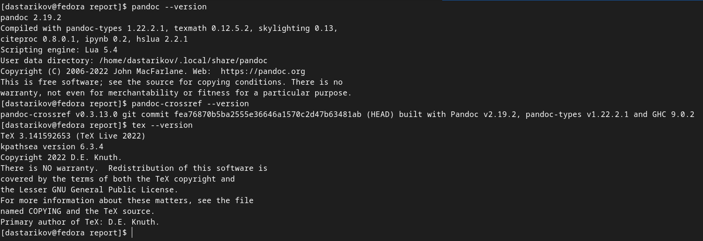
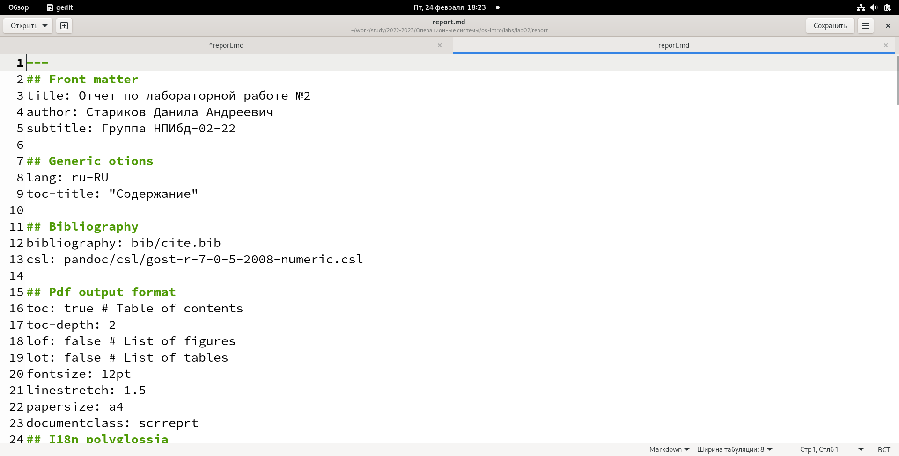

---
## Front matter
lang: ru-RU
title: "Лабораторная работа №3"
subtitle: "Дисциплина: Операционные системы"
author:
  - Стариков Д. А., cтудент НПИбд-02-22
institute:
  - Российский университет дружбы народов, Москва, Россия
date: 25 февраля 2023


## i18n babel
babel-lang: russian
babel-otherlangs: english

## Formatting pdf
toc: false
toc-title: Содержание
slide_level: 2
aspectratio: 169
section-titles: true
theme: metropolis
header-includes:
 - \metroset{progressbar=frametitle,sectionpage=progressbar,numbering=fraction}
 - '\makeatletter'
 - '\beamer@ignorenonframefalse'
 - '\makeatother'
---

# Вводная часть

## Цели и задачи

- Научиться оформлять отчёты с помощью легковесного языка разметки Markdown
- Научиться конвертировать файлы `md` в `pdf` и `docx` с помощью утилиты `pandoc`
- Написать отчет по лабораторной работе №2 в формате Markdown

# Выполнение лабораторной работы

## Необходимое для работы ПО

:::::::::::::: {.columns align=center}
::: {.column width="30%"}

- Pandoc: v2.19.2
- Pandoc-crossref v0.3.13.0, совместимый с версией Pandoc
- TeX Live 2022

:::
::: {.column width="70%"}



:::
::::::::::::::

## Makefile для генерации pdf и docx

```{.makefile .numberLines}
FILES = $(patsubst %.md, %.docx, $(wildcard *.md))
FILES += $(patsubst %.md, %.pdf, $(wildcard *.md))

FILTERS =
OPTIONS =
PDF_ENGINE =
PDF_OPTIONS =
FORMAT_OPTIONS =

### Cross references
## Use pandoc-xnos (https://github.com/tomduck/pandoc-xnos)
## Local pandoc-xnos
FILTERS += --filter pandoc/filters/pandoc_fignos.py \
```

## Makefile для генерации pdf и docx

```{.makefile .numberLines startFrom="14"}
	--filter pandoc/filters/pandoc_eqnos.py \
	--filter pandoc/filters/pandoc_tablenos.py \
	--filter pandoc/filters/pandoc_secnos.py
## System-wide pandoc-xnos
# FILTERS += --filter pandoc-fignos --filter pandoc-eqnos \
	--filter pandoc-tablenos --filter pandoc-secnos
## Use pandoc-crossref (https://github.com/lierdakil/pandoc-crossref)
# FILTERS += --filter pandoc-crossref
###
PDF_ENGINE += --pdf-engine=lualatex --pdf-engine-opt=--shell-escape
OPTIONS += --number-sections
BIB_OPTIONS = --citeproc
```

## Makefile для генерации pdf и docx

```{.makefile .numberLines startFrom="26"}
%.docx: %.md
	-pandoc "$<" $(FILTERS) $(OPTIONS) $(BIB_OPTIONS) -o "$@"

%.pdf: %.md
	-pandoc "$<" $(FILTERS) $(PDF_ENGINE) $(PDF_OPTIONS) \
	$(BIB_OPTIONS) $(FORMAT_OPTIONS) $(OPTIONS) -o "$@"

all: $(FILES)


clean:
	-rm $(FILES) *~

cleanall: clean
```

## Редактирование отчета в текстовом редакторе gedit



# Выводы

- Получили практические навыки работы с языком разметки Markdown
- Научились генерировать из файлов формата `md` файл формата `pdf` и `docx` с помощью утилиты `pandoc`
- Сделали отчет по Лабораторной работе №2
