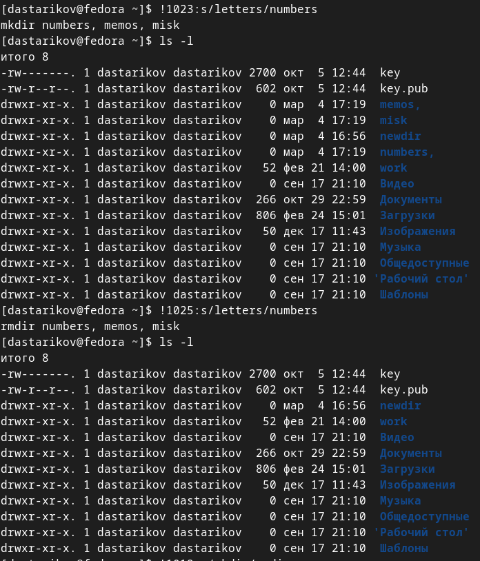

---
## Front matter
lang: ru-RU
title: "Лабораторная работа №4. Основы интерфейса взаимодействия пользователя с системой Unix на уровне командной строки"
subtitle: "Дисциплина: Операционные системы"
author:
  - Стариков Д. А., cтудент НПИбд-02-22
institute:
  - Российский университет дружбы народов, Москва, Россия
date: 4 марта 2023

## i18n babel
babel-lang: russian
babel-otherlangs: english

## Formatting pdf
toc: false
toc-title: Содержание
slide_level: 2
aspectratio: 169
section-titles: true
theme: metropolis
header-includes:
 - \metroset{progressbar=frametitle,sectionpage=progressbar,numbering=fraction}
 - '\makeatletter'
 - '\beamer@ignorenonframefalse'
 - '\makeatother'
 
## Pandoc-crossref customization

figureTitle: ""
 
---

# Вводная часть

## Цели и задачи

- Приобрести практичекие навыки взаимодействия пользователя с системой посредством командной строки

# Выполнение лабораторной работы

## Выполнение лабораторной работы

{#fig:fig01 width=20%}

{#fig:fig02 width=55%}

{#fig:fig03 width=55%}

## Выполнение лабораторной работы

{#fig:fig06 width=70%}

{#fig:fig07 width=70%}

## Выполнение лабораторной работы

{#fig:fig08 width=65%}

{#fig:fig09 width=50%}

## Получение справки по командам cd, pwd, mkdir и rmdir

:::::::::::::: {.columns align=center}
::: {.column}

{#fig:fig091 width=110%}

{#fig:fig092 height=40%}

:::
::: {.column}

{#fig:fig093 width=70%}

{#fig:fig094 width=70%}

:::
::::::::::::::

## Работа с `history`

:::::::::::::: {.columns align=center}
::: {.column}

{#fig:fig-history}

:::
::: {.column}

{#fig:fig10 width=75%}

:::
::::::::::::::

# Выводы

- Получили практические навыки работы с командной строкой
- Познакомились с командой получения справочной информации `man`
