---
## Front matter
title: "Отчет по лабораторной работе №4"
subtitle: "Основы интерфейса взаимодействия пользователя с системой Unix на уровне командной строки"
author: "Данила Андреевич Стариков"

## Generic otions
lang: ru-RU
toc-title: "Содержание"

## Bibliography
bibliography: bib/cite.bib
csl: pandoc/csl/gost-r-7-0-5-2008-numeric.csl

## Pdf output format
toc: true # Table of contents
toc-depth: 2
lof: false # List of figures
lot: false # List of tables
fontsize: 12pt
linestretch: 1.5
papersize: a4
documentclass: scrreprt
## I18n polyglossia
polyglossia-lang:
  name: russian
  options:
	- spelling=modern
	- babelshorthands=true
polyglossia-otherlangs:
  name: english
## I18n babel
babel-lang: russian
babel-otherlangs: english
## Fonts
mainfont: PT Serif
romanfont: PT Serif
sansfont: PT Sans
monofont: PT Mono
mainfontoptions: Ligatures=TeX
romanfontoptions: Ligatures=TeX
sansfontoptions: Ligatures=TeX,Scale=MatchLowercase
monofontoptions: Scale=MatchLowercase,Scale=0.9
## Biblatex
biblatex: true
biblio-style: "gost-numeric"
biblatexoptions:
  - parentracker=true
  - backend=biber
  - hyperref=auto
  - language=auto
  - autolang=other*
  - citestyle=gost-numeric
## Pandoc-crossref LaTeX customization
figureTitle: "Рис."
tableTitle: "Таблица"
listingTitle: "Листинг"
lofTitle: "Список иллюстраций"
lotTitle: "Список таблиц"
lolTitle: "Листинги"
## Misc options
indent: true
header-includes:
  - \usepackage{indentfirst}
  - \usepackage{float} # keep figures where there are in the text
  - \floatplacement{figure}{H} # keep figures where there are in the text
---

# Цель работы

Приобретение практических навыков взаимодействия пользователя с системой посредством командной строки.

# Выполнение лабораторной работы

Находясь в домашнем каталоге, вывели на экран его полный путь по команде `pwd` (Рис. [-@:fig01]).

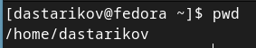{#fig:fig01}

Далее перешли в каталог `/tmp` и вывели на экран его содержимое с помощью команды `ls` с различными ключами: 

- ключ `-l` (Рис. [-@fig:fig02]) показывает полную информацию о файле: право доступа, число ссылок, владельца, размер, дату последней ревизии, имя файла или каталога;

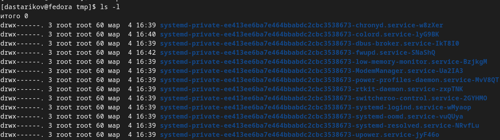{#fig:fig02}

- ключ `-a` (Рис. [-@fig:fig03]) дополтельно показывает скрытые файлы и каталоги.

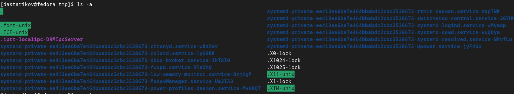{#fig:fig03}

Далее проверили, есть ли в каталоге `/var/spool` подкаталог `cron` (Рис. [-@fig:fig04]):

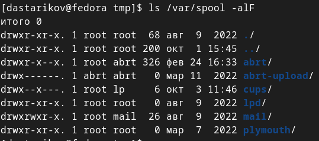{#fig:fig04}

Перешли в домашний каталог, вывели его содержимое с ключом `-l` для определения владельца файлов и каталогов. Владелец  - `dastarikov` (Рис. [-@fig:fig05]).

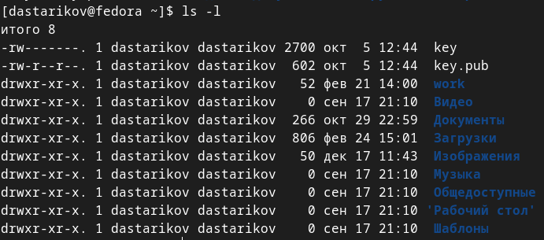{#fig:fig05}

Затем в домашнем каталоге создали подкаталог `newdir` и внутри него каталог `morefun`; с помощью одной командый `mkdir letters memos misk` одновременно создали 3 каталога, затем также их удалили `rmdir letters memos misk` (Рис. [-@fig:fig06]).

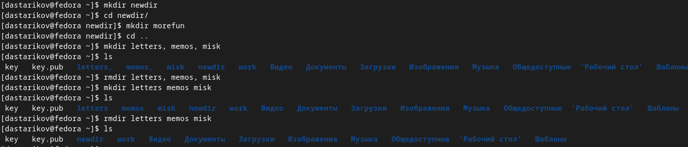{#fig:fig06}

При попытке удалить каталог `rm newdir` появляется ошибка и каталог не удаляется. Удаляем каталог `~/newdir/morefun` с помощью команды `rmdir` (Рис. [-@fig:fig07]).

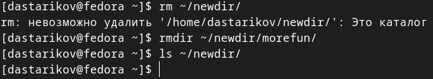{#fig:fig07}

С помощью `man`, которая выводит на экран справочную информацию о командах, нашли:

- ключ, чтобы вывести содержимое текущего каталога и всех его подкаталогов - `ls -R` (Рис. [-@fig:fig08]);

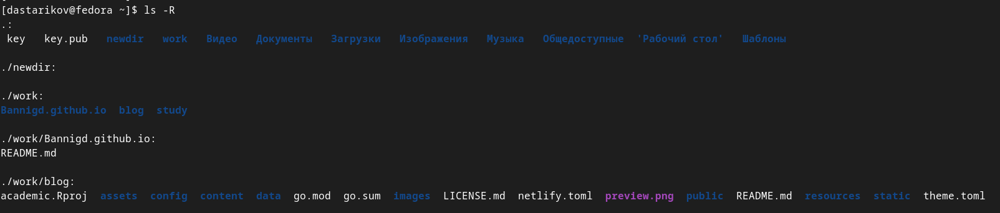{#fig:fig08}

- комбинацию ключей `-ctl` для вывода содержимого каталога c развернутым описанием файлов, отсортированного в порядке уменьшения даты последнего изменения (Рис. [-@fig:fig09]).

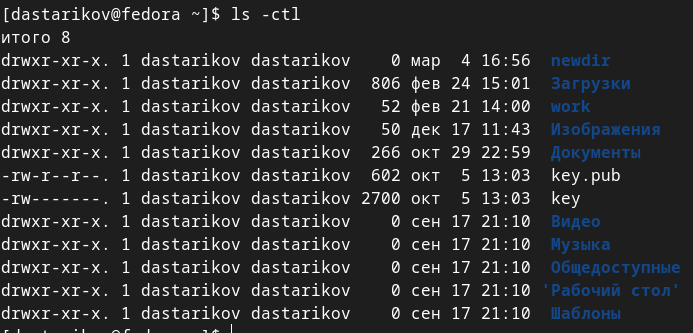{#fig:fig09}

Также с помощью команды `man` получили справочную информацию по следующим командам:

1. `cd`

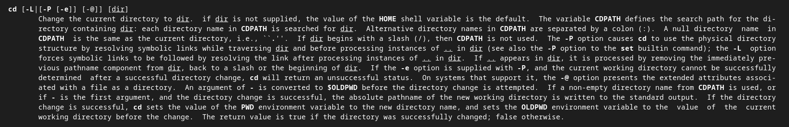{#fig:fig091}

2. `pwd`

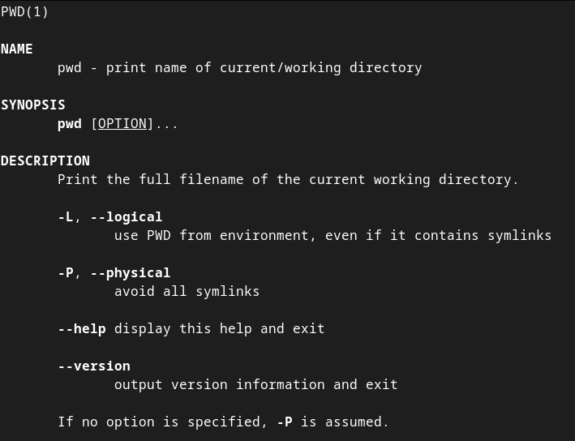{#fig:fig092}

3. `mkdir`

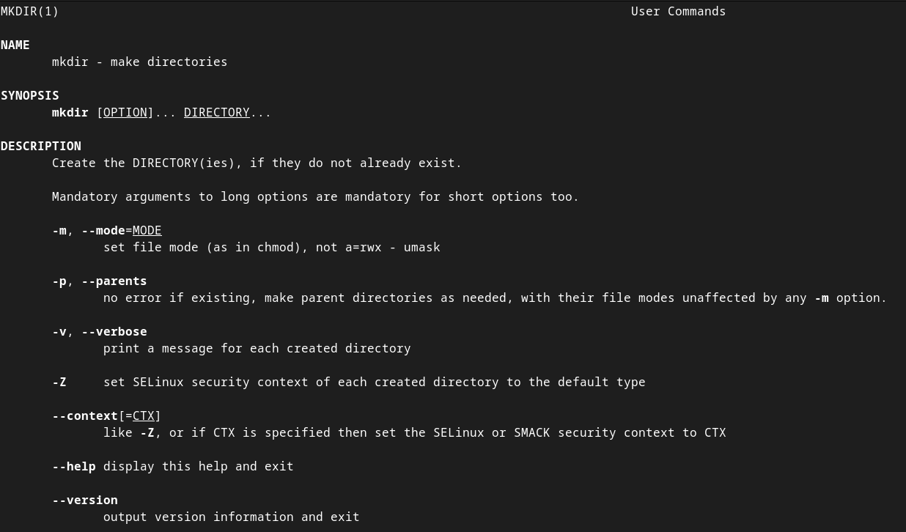{#fig:fig093}

4. `rmdir`

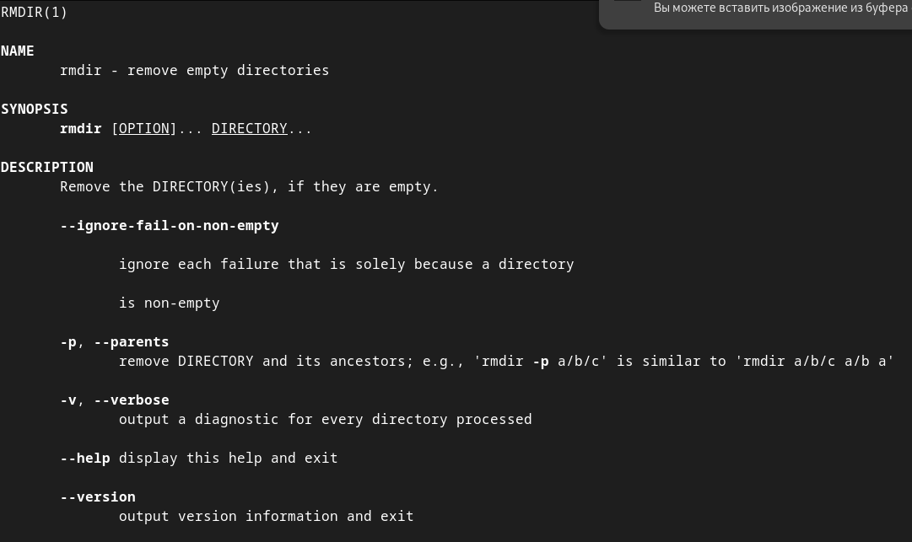{#fig:fig094}

Вызвали команду `history`, которая вывела на экран историю прошлых вызовов команд (Рис. [-@fig:fig-history]). Затем модифицировали команды из буфера и выполнили (Рис. [-@fig:fig10] и [-@fig:fig11]): 

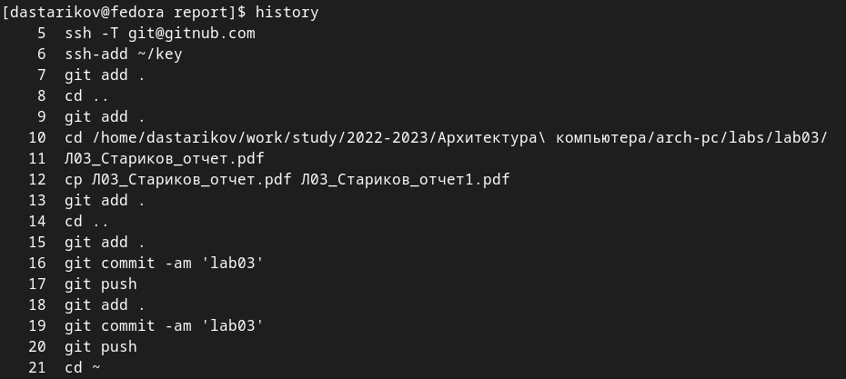{#fig:fig-history}

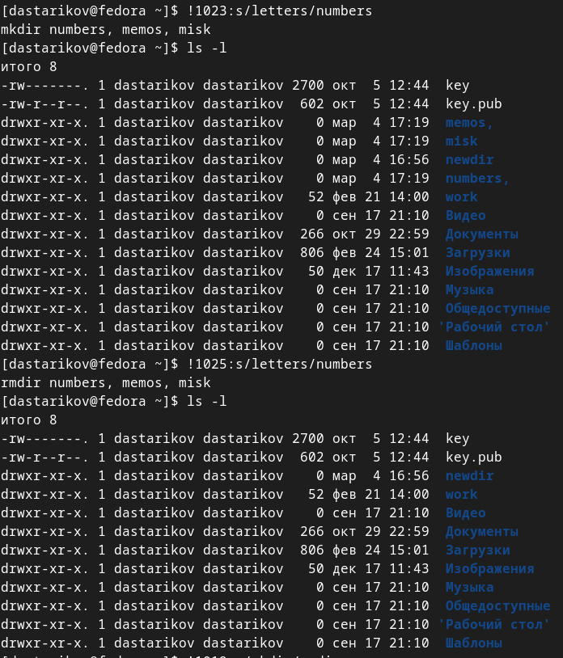{#fig:fig10}

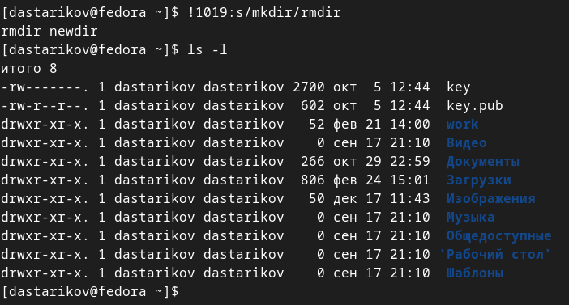{#fig:fig11}

# Выводы

В рамках лабораторной работы получили праткические навыки работы с комадной строкой: навигация, создание и удаление каталогов, получение справочной информации о необходимых командах.

