---
## Front matter
lang: ru-RU
title: "Лабораторная работа №5. Анализ файловой системы Linux. Команды для работы с файлами и каталогами."
subtitle: "Дисциплина: Операционные системы"
author:
  - Стариков Д. А., cтудент НПИбд-02-22
institute:
  - Российский университет дружбы народов, Москва, Россия
date: 11 марта 2023

## i18n babel
babel-lang: russian
babel-otherlangs: english

## Formatting pdf
toc: false
toc-title: Содержание
slide_level: 2
aspectratio: 169
section-titles: true
theme: metropolis
header-includes:
 - \metroset{progressbar=frametitle,sectionpage=progressbar,numbering=fraction}
 - '\makeatletter'
 - '\beamer@ignorenonframefalse'
 - '\makeatother'
---

# Вводная часть

## Цели и задачи

- Познакоматься с файловой системой Linux, ее структурой, именам и содержанием каталогов
- Приобрести практические навыки по применению команд для работы с файлами и каталогами

# Выполнение лабораторной работы

## Задание 1. Примеры из первой части описания лабораторной работы

- Копирование файлов или каталогов

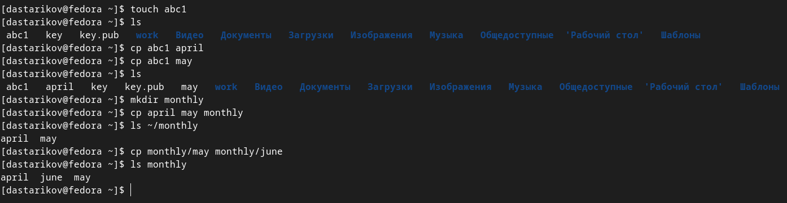

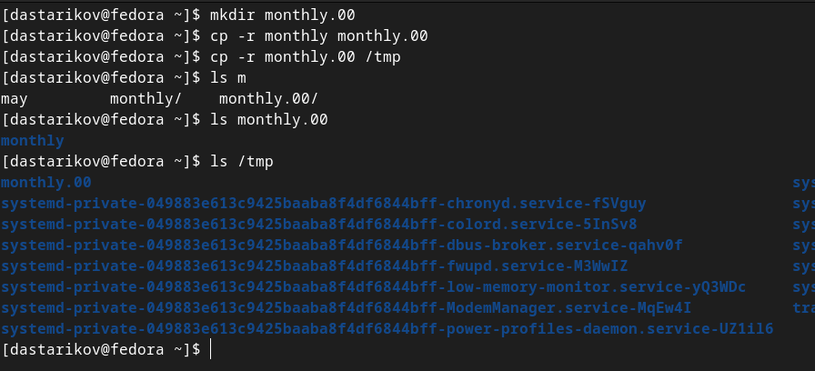

## Задание 1. Примеры из первой части описания лабораторной работы

- Перемещение и переименование файлов и каталогов

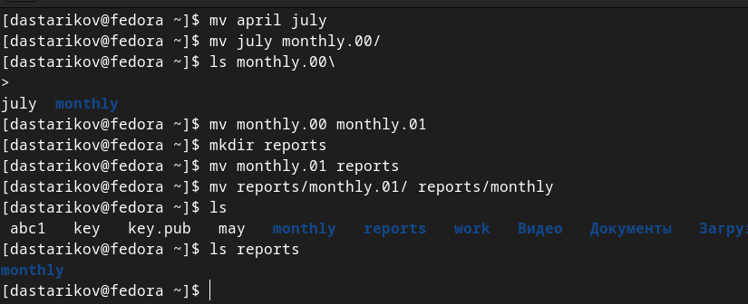

## Задание 1. Примеры из первой части описания лабораторной работы

- Изменение прав доступа 

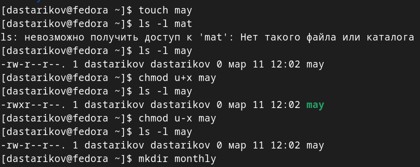{width=80% }

## Задание 1. Примеры из первой части описания лабораторной работы

- Изменение прав доступа 

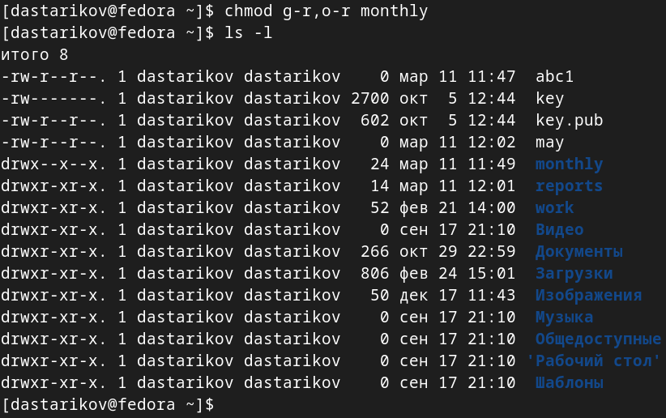{width=80% }

## Задание 1. Примеры из первой части описания лабораторной работы

- Изменение прав доступа 

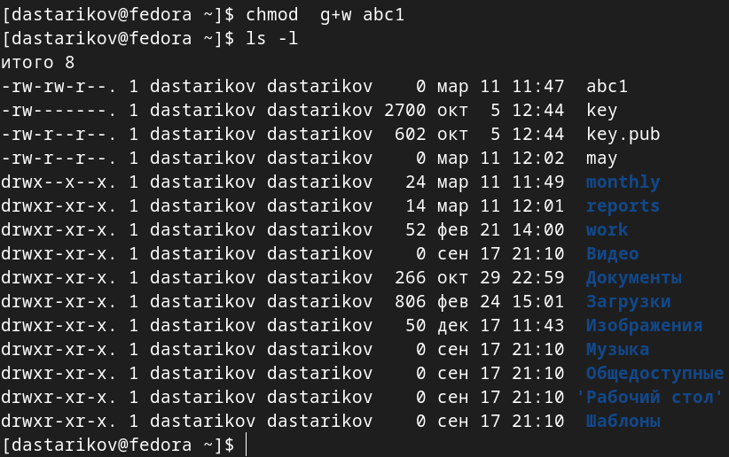{width=70% }

## Задание 2.

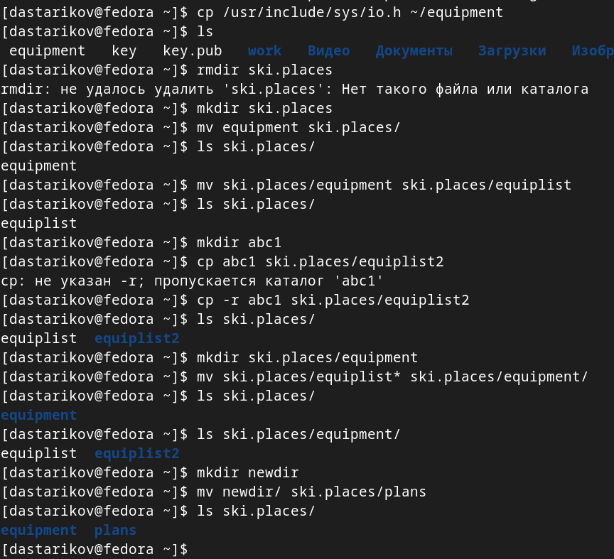{width=70% }

## Задание 3.

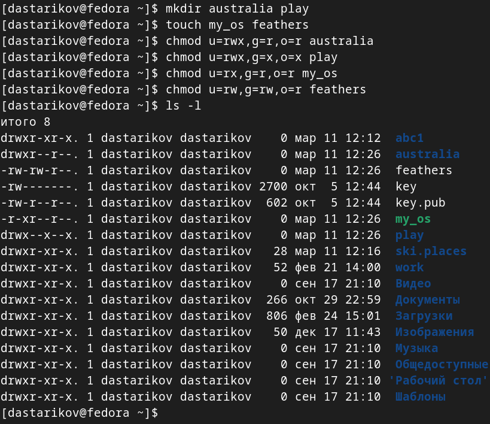{width=70% }

## Задание 4.

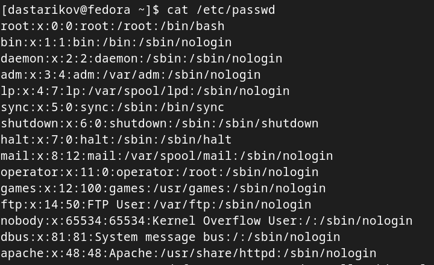{width=70% }

## Задание 4.

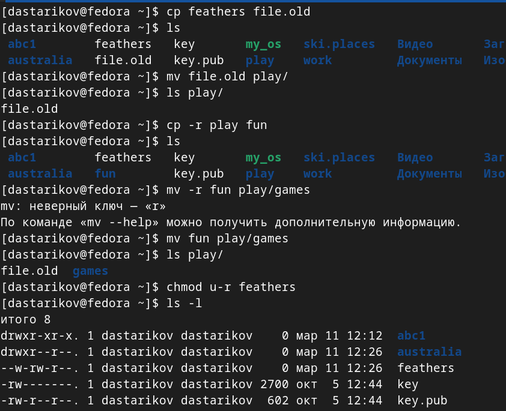{width=80% }

## Задание 4.

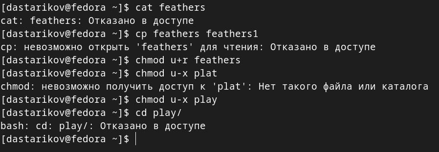{width=80% }

## Задание 5.

1. `mount` --- утилита командной строки для монтирования файловых систем.
2. `fsck` --- утилита командной строки для проверки и восстановления целостности файловой системы.
3. `mkfs` --- утилита командной строки для создания файловой системы.
4. `kill` --- утилита командной строки для посылания различных сигналов определенным процессам (завершение, принудительное завершение, приостановка и продолжение и т.д.).

# Выводы

- Познакомились с файловой системой Linux
- Приобрели практические навыки по применению команд для работы с файлами и каталогами: `cd`, `touch`, `mkdir`, `mv`, `cp` и другие.

