---
## Front matter
title: "Отчет по лабораторной работе №5"
subtitle: "Анализ файловой системы Linux. Команды для работы с файлами и каталогами."
author: "Данила Андреевич Стариков"

## Generic otions
lang: ru-RU
toc-title: "Содержание"

## Bibliography
bibliography: bib/cite.bib
csl: pandoc/csl/gost-r-7-0-5-2008-numeric.csl

## Pdf output format
toc: true # Table of contents
toc-depth: 2
lof: false # List of figures
lot: false # List of tables
fontsize: 12pt
linestretch: 1.5
papersize: a4
documentclass: scrreprt
## I18n polyglossia
polyglossia-lang:
  name: russian
  options:
	- spelling=modern
	- babelshorthands=true
polyglossia-otherlangs:
  name: english
## I18n babel
babel-lang: russian
babel-otherlangs: english
## Fonts
mainfont: PT Serif
romanfont: PT Serif
sansfont: PT Sans
monofont: PT Mono
mainfontoptions: Ligatures=TeX
romanfontoptions: Ligatures=TeX
sansfontoptions: Ligatures=TeX,Scale=MatchLowercase
monofontoptions: Scale=MatchLowercase,Scale=0.9
## Biblatex
biblatex: true
biblio-style: "gost-numeric"
biblatexoptions:
  - parentracker=true
  - backend=biber
  - hyperref=auto
  - language=auto
  - autolang=other*
  - citestyle=gost-numeric
## Pandoc-crossref LaTeX customization
figureTitle: "Рис."
tableTitle: "Таблица"
listingTitle: "Листинг"
lofTitle: "Список иллюстраций"
lotTitle: "Список таблиц"
lolTitle: "Листинги"
## Misc options
indent: true
header-includes:
  - \usepackage{indentfirst}
  - \usepackage{float} # keep figures where there are in the text
  - \floatplacement{figure}{H} # keep figures where there are in the text
---

# Цель работы

Ознакомление с файловой системой Linux, её структурой, именами и содержанием каталогов. Приобретение практических навыков по применению команд для работы с файлами и каталогами, по управлению процессами (и работами), по проверке использования диска и обслуживанию файловой системы.

# Выполнение лабораторной работы

**Задание 1. Примеры из первой части описания лабораторной работы**

- Копирование файлов или каталогов (Рис. [-@fig:fig01] и [-@fig:fig02]):

    1. В домашнем каталоге создали файл `abc1` и скопировали его в файлы `april` и `may`.
    2. Создали каталог `monthly` и скопировали файлы `april` и `may` одной командой.
    3. Скопировали файл в `monthly/may` в `monthly/june`.
    4. Скопировали каталог `monthly` в `monthly.00` с ключом `-r`, так как каталог содержит файлы.
    5. Скопировали каталог `monthly.00` в произвольный каталог `/tmp` (указан полный адрес к каталогу).
    
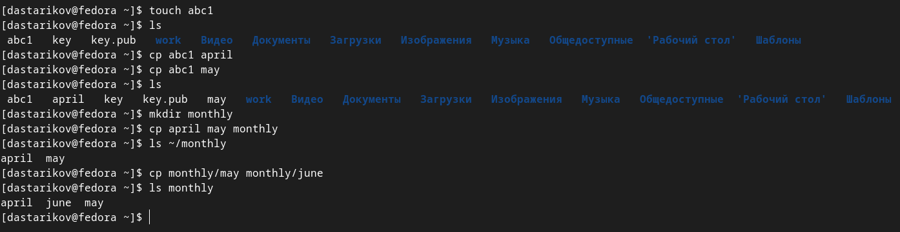{#fig:fig01}

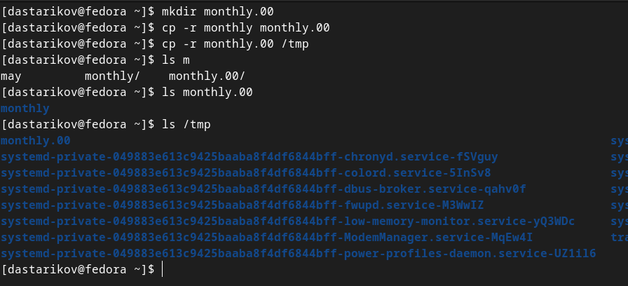{#fig:fig02}

- Перемещение и переименование файлов и каталогов (Рис. [-@fig:fig03]):

    1. Изменили название файла `april` на `july` в домашнем каталоге.
    2. Переместили файл `july` в каталог `monthly.00`.
    3. Переименовали каталог `monthly.00` в `monthly.01`.
    4. Переместили каталог `monthly.01` в каталог `reports`.
    5. Переименовали каталог `reports/monthly.01` в `reports/monthly`.
    
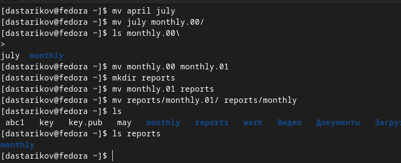{#fig:fig03}

- Изменение прав доступа (Рис. [-@fig:fig04] и [-@fig:fig05] и [-@fig:fig06]):

    1. Создали файл `~/may` с правом выполнения для владельца.
    2. Лишили владельца файла `~/may` права на выполнение.
    3. Cоздали каталог `monthly` с запретом на чтение для членов группы и всех остальных пользователей.
    4. Создали файл `~/abc1` с правом записи для членов группы.

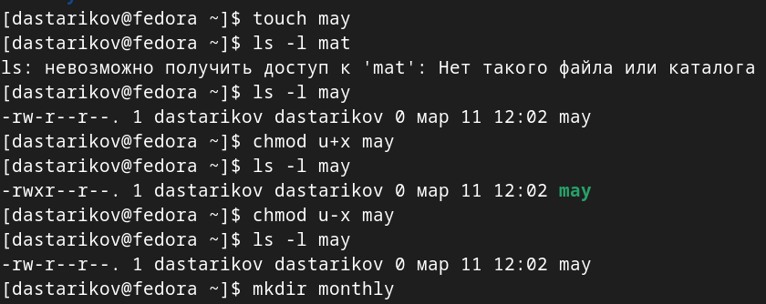{#fig:fig04}

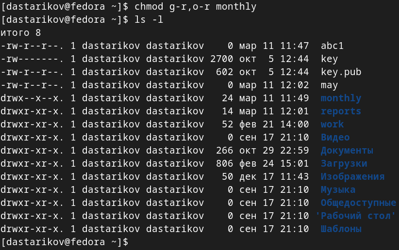{#fig:fig05}

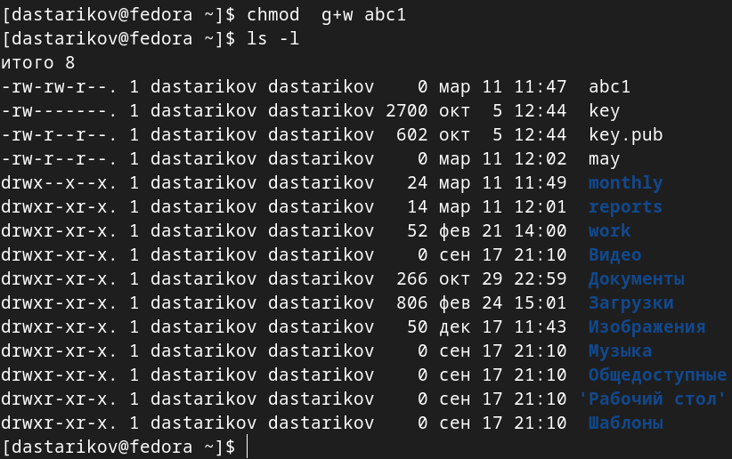{#fig:fig06}

**Задание 2.** (Рис. [-@fig:fig07])

1. Скопировали файл `/usr/include/sys/io.h` в домашний каталог и назвали его `equipment`.
2. В домашнем каталоге создали директорию `~/ski.plases`.
3. Переместили файл equipment в каталог `~/ski.plases`.
4. Переименовали файл `~/ski.plases/equipment` в `~/ski.plases/equiplist`.
5. Создали в домашнем каталоге файл `abc1` и скопировали его в каталог `~/ski.plases`, назвали его `equiplist2`.
6. Создали каталог с именем `equipment` в каталоге `~/ski.plases`.
7. Переместили файлы `~/ski.plases/equiplist` и `equiplist2` в каталог `~/ski.plases/equipment`.
8. Создали и переместили каталог `~/newdir` в каталог `~/ski.plases` и назвали его `plans`.

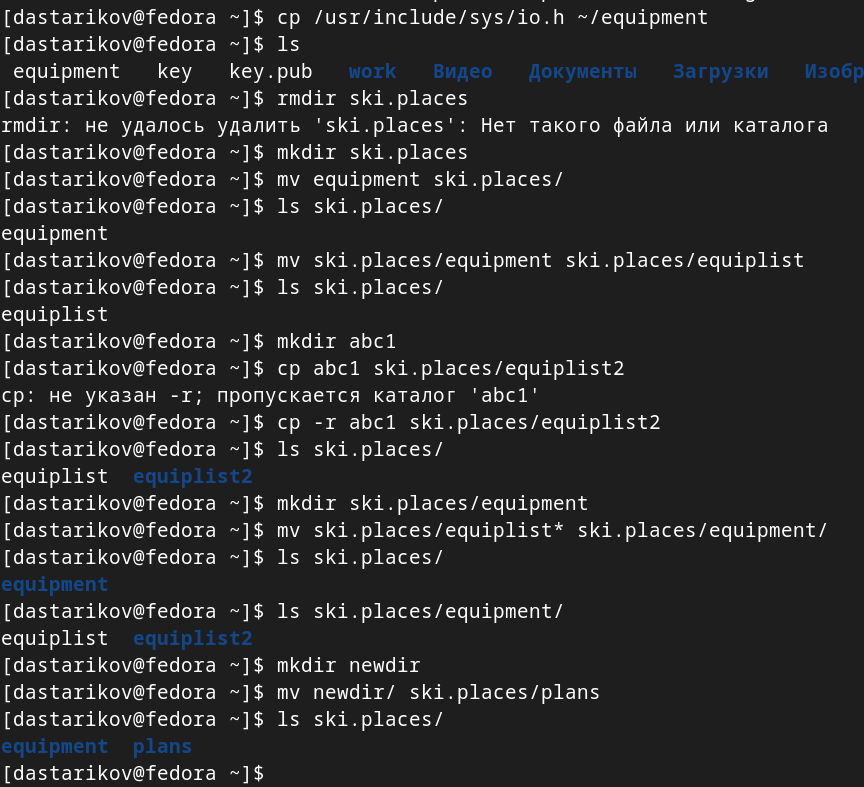{#fig:fig07}

**Задание 3.** (Рис. [-@fig:fig08])

 Определили опции команды chmod, необходимые для того, чтобы присвоить перечисленным ниже файлам выделенные права доступа, считая, что в начале таких прав нет:
 
1. `drwxr--r--`: `australia`.
2. `drwx--x--x`: `play`.
3. `-r-xr--r--`: `my_os`.
4. `-rw-rw-r--`: `feather`.

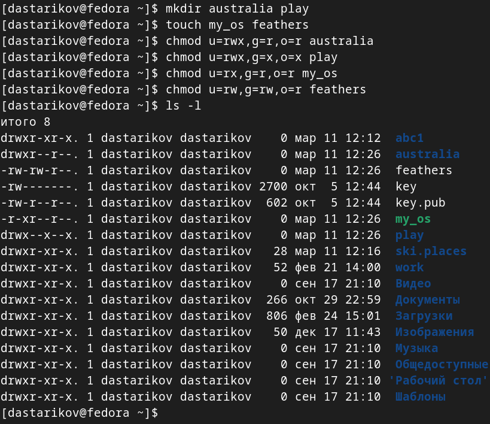{#fig:fig08}

**Задание 4.** (Рис. [-@fig:fig09], [-@fig:fig10], [-@fig:fig11])

1. Просмотрели содержимое файла `/etc/password` (команда: `cat /etc/password`).
2. Скопировали файл `~/feathers` в файл `~/file.old` (команда: `cp feathers file.old`).
3. Переместили файл `~/file.old` в каталог `~/play` (команда: `mv file.old play/`).
4. Скопировали каталог `~/play` в каталог `~/fun` (команда: `cp -r play fun`).
5. Переместили каталог `~/fun` в каталог `~/play` и назовите его `games` (команда: `mv fun play/games`).
6. Лишили владельца файла `~/feathers` права на чтение (команда: `chmod u-r feathers`).
7. При попытке просмотреть файл `~/feathers` командой cat (команда: `cat feathers`) появилась ошибка отказа в доступе.
8. При попытке скопировать файл `~/feathers` (команда: `cp feathers feathers1`) появилась ошибка отказа в доступе.
9. Дали владельцу файла `~/feathers` право на чтение (команда: `chmod u+r feathers`).
10. Лишили владельца каталога `~/play` права на выполнение (команда: `chmod u-x play`).
11. При попытке перейти в каталог `~/play` (команда: `cd play`) появилась ошибка отказа в доступе.
12. Дали владельцу каталога `~/play` право на выполнение (команда: `chmod u+x play`).

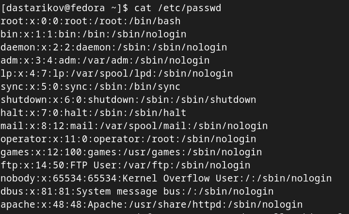{#fig:fig09}

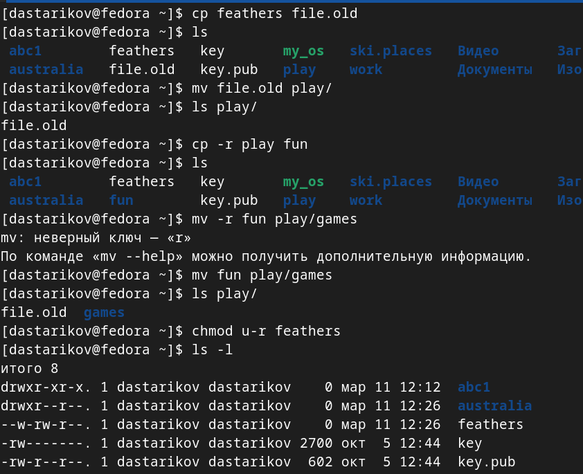{#fig:fig10}

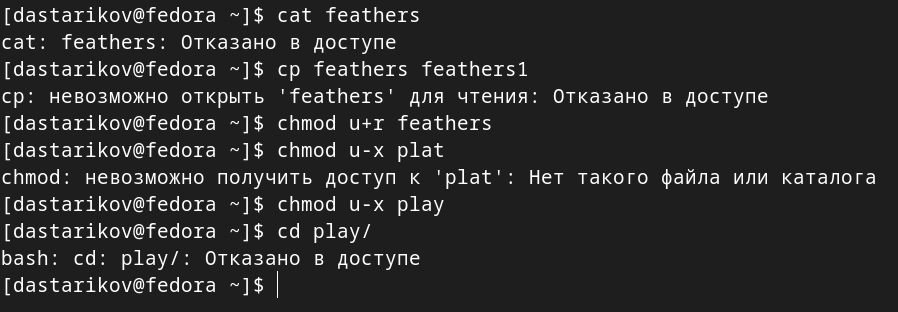{#fig:fig11}

**Задание 5.** (Рис. [-@fig:fig07])

Получили справочную информацию по командам `mount`, `fsck`, `mkfs`, `kill` c помощью утилиты `man`:

1. `mount` --- утилита командной строки для монтирования файловых систем.
2. `fsck` --- утилита командной строки для проверки и восстановления целостности файловой системы.
3. `mkfs` --- утилита командной строки для создания файловой системы.
4. `kill` --- утилита командной строки для посылания различных сигналов определенным процессам (завершение, принудительное завершение, приостановка и продолжение и т.д.).

# Выводы

В рамках лабораторной работы познакомилсь с файловой системой Linux, её структурой, именами и содержанием каталогов. Приобрели практические навыки по применению команд для работы с файлами и каталогами, по управлению процессами (и работами), по проверке использования диска и обслуживанию файловой системы.

