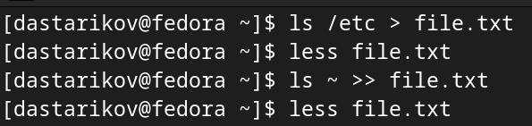
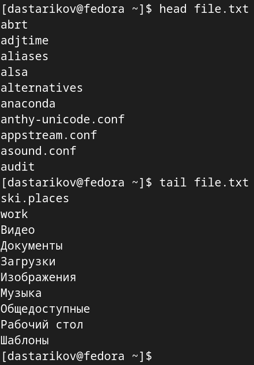
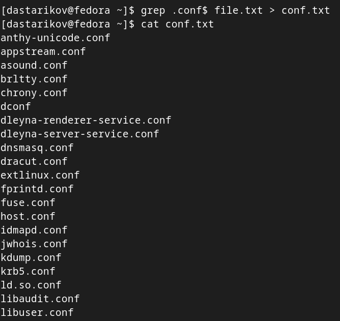
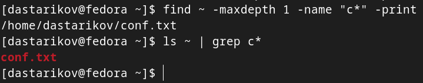
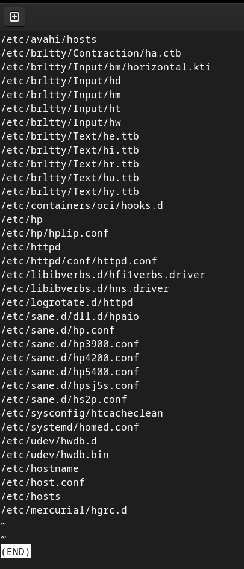
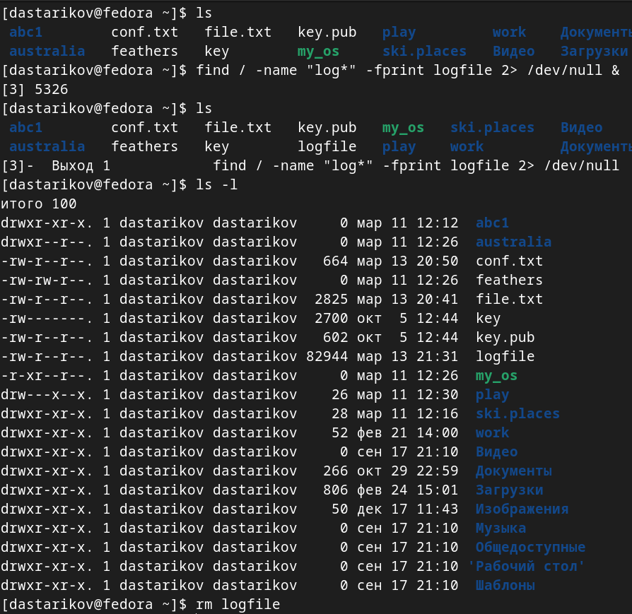
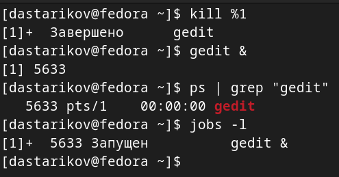
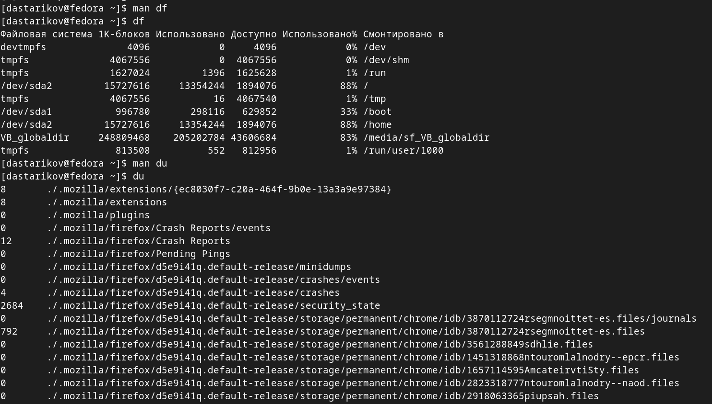
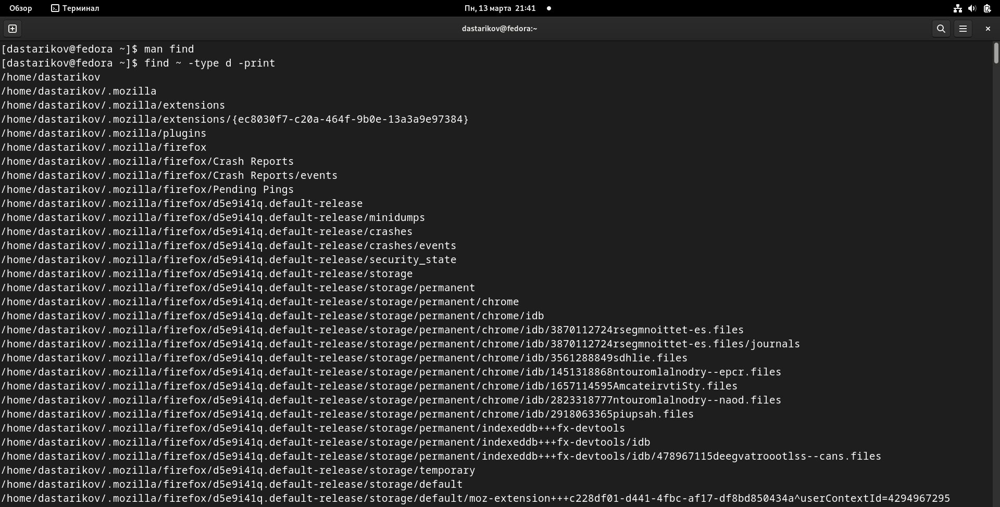

---
## Front matter
lang: ru-RU
title: "Лабораторная работа №6. Поиск файлов. Перенаправление ввода-вывода. Просмотр запущенных процессов."
subtitle: "Дисциплина: Операционные системы"
author:
  - Стариков Д. А., cтудент НПИбд-02-22
institute:
  - Российский университет дружбы народов, Москва, Россия
date: 17 марта 2023

## i18n babel
babel-lang: russian
babel-otherlangs: english

## Formatting pdf
toc: false
toc-title: Содержание
slide_level: 2
aspectratio: 169
section-titles: true
theme: metropolis
header-includes:
 - \metroset{progressbar=frametitle,sectionpage=progressbar,numbering=fraction}
 - '\makeatletter'
 - '\beamer@ignorenonframefalse'
 - '\makeatother'
 
## Pandoc-crossref LaTeX customization
figureTitle: "Рис."
---

# Вводная часть

## Цели и задачи

- Познакомиться с интрументами поиска и фильтрации текстовых данных
- Получение навыков по управлению процессами и обслуживанию файловых систем

# Выполнение лабораторной работы

## Задание 1

:::::::::::::: {.columns align=center}
::: {.column width="50%"}

Записали в файл `file.txt` названия файлов, содержащихся в каталоге `/etc` и дописали в этот же файл названия файлов, содержащихся в вашем домашнем каталоге (Рис. [-@fig:fig01] и [-@fig:fig02]).

{#fig:fig01}

:::
::: {.column width="50%"}

{#fig:fig02 width=70%}

:::
::::::::::::::

## Задание 2 

:::::::::::::: {.columns align=center}
::: {.column width="30%"}

Вывели имена всех файлов из `file.txt`, имеющих расширение `.conf`, после чего записали их в новый текстовой файл `conf.txt` (Рис. [-@fig:fig03])

:::
::: {.column width="70%"}

{#fig:fig03 width=70%}

:::
::::::::::::::

## Задание 3

Определили, какие файлы в  домашнем каталоге имеют имена, начинавшиеся с символа `"c"` несколькими способами  (Рис. [-@fig:fig04]):
    
    * `find ~ -maxdepth 1 -name "c*" -print`
    * `ls ~ | grep c*`

{#fig:fig04}

## Задание 4

:::::::::::::: {.columns align=center}
::: {.column width="60%"}

Вывели на экран (по странично) имена файлов из каталога `/etc`, начинающиеся с символа `"h"` командой `find /etc -name "h*" -print | less` (Рис. [-@fig:fig05])

:::
::: {.column width="40%"}

{#fig:fig05 width=50%}

:::
::::::::::::::

## Задание 5

Запустили в фоновом режиме процесс, который записывает в файл `~/logfile` файлы, имена которых начинаются с `"log"`, убедились, что он создался, и затем удалили (Рис. [-@fig:fig06]).

{#fig:fig06 width=40%}

## Задание 6

Запустили из консоли в фоновом режиме редактор `gedit`, определили идентификатор процесса `gedit` несколькими способами (Рис. [-@fig:fig07]):
    
    * `ps | grep "gedit"`
    * `jobs -l`
    
{#fig:fig07 width=50%}
    
## Задание 7

Прочли справку `man` команды `kill` и использовали ее для завершения процесса `gedit` (Рис. [-@fig:fig08] и [-@fig:fig09]).

:::::::::::::: {.columns align=center}
::: {.column width="60%"}

{#fig:fig08}

:::
::: {.column width="40%"}

{#fig:fig09}

:::
::::::::::::::

## Задание 8

Выполнили команды df и du, предварительно получив более подробную информацию об этих командах, с помощью команды man (Рис. [-@fig:fig10]).

{#fig:fig10 width=70%}

## Задание 9

Воспользовавшись справкой команды find, вывели имена всех директорий, имеющихся в домашнем каталоге (Рис. [-@fig:fig11])

{#fig:fig11 width=70%}

# Выводы

- Познакомились с интрументами поиска и фильтрации текстовых данных
- Получили практические навыки по управлению процессами и обслуживанию файловых систем
