---
## Front matter
title: "Отчет по "
subtitle: "Поиск файлов. Перенаправление ввода-вывода. Просмотр запущенных процессов"
author: "Данила Андреевич Стариков"

## Generic otions
lang: ru-RU
toc-title: "Содержание"

## Bibliography
bibliography: bib/cite.bib
csl: pandoc/csl/gost-r-7-0-5-2008-numeric.csl

## Pdf output format
toc: true # Table of contents
toc-depth: 2
lof: false # List of figures
lot: false # List of tables
fontsize: 12pt
linestretch: 1.5
papersize: a4
documentclass: scrreprt
## I18n polyglossia
polyglossia-lang:
  name: russian
  options:
	- spelling=modern
	- babelshorthands=true
polyglossia-otherlangs:
  name: english
## I18n babel
babel-lang: russian
babel-otherlangs: english
## Fonts
mainfont: PT Serif
romanfont: PT Serif
sansfont: PT Sans
monofont: PT Mono
mainfontoptions: Ligatures=TeX
romanfontoptions: Ligatures=TeX
sansfontoptions: Ligatures=TeX,Scale=MatchLowercase
monofontoptions: Scale=MatchLowercase,Scale=0.9
## Biblatex
biblatex: true
biblio-style: "gost-numeric"
biblatexoptions:
  - parentracker=true
  - backend=biber
  - hyperref=auto
  - language=auto
  - autolang=other*
  - citestyle=gost-numeric
## Pandoc-crossref LaTeX customization
figureTitle: "Рис."
tableTitle: "Таблица"
listingTitle: "Листинг"
lofTitle: "Список иллюстраций"
lotTitle: "Список таблиц"
lolTitle: "Листинги"
## Misc options
indent: true
header-includes:
  - \usepackage{indentfirst}
  - \usepackage{float} # keep figures where there are in the text
  - \floatplacement{figure}{H} # keep figures where there are in the text
---

# Цель работы

Ознакомление с инструментами поиска файлов и фильтрации текстовых данных. Приобретение практических навыков: по управлению процессами (и заданиями), по проверке использования диска и обслуживанию файловых систем

# Выполнение лабораторной работы

1. Записали в файл `file.txt` названия файлов, содержащихся в каталоге `/etc` и дописали в этот же файл названия файлов, содержащихся в вашем домашнем каталоге (Рис. [-@fig:fig01] и [-@fig:fig02]).

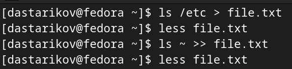{#fig:fig01}

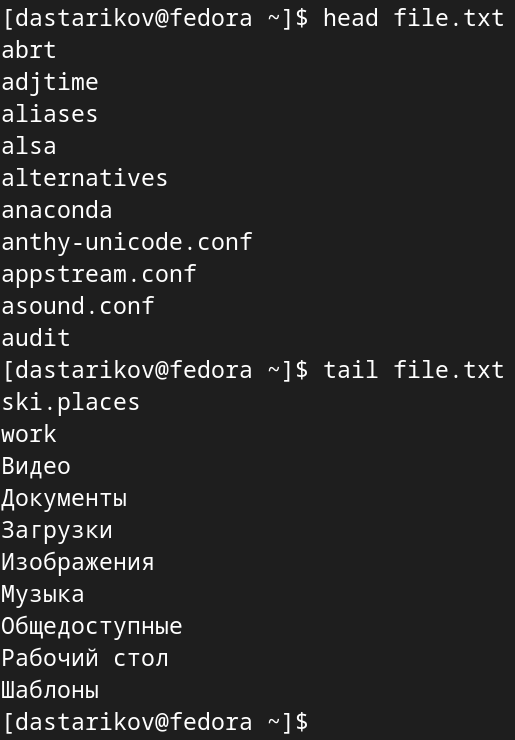{#fig:fig02}

2. Вывели имена всех файлов из `file.txt`, имеющих расширение `.conf`, после чего записали их в новый текстовой файл `conf.txt` (Рис. [-@fig:fig03])

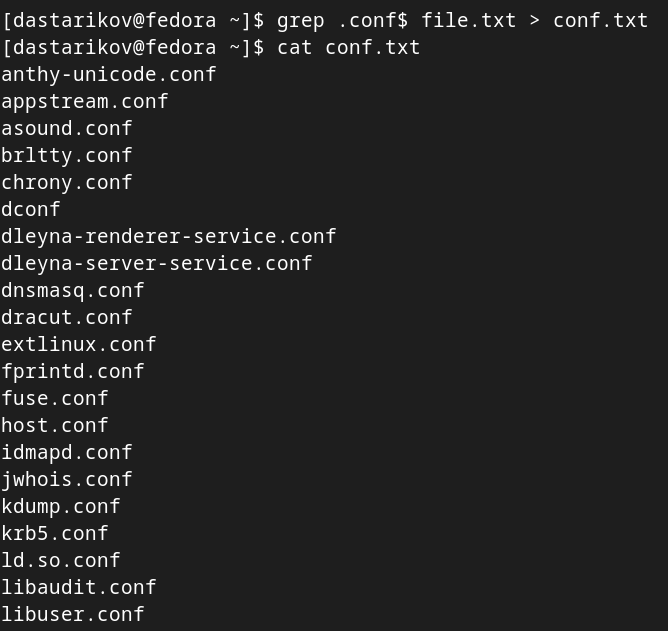{#fig:fig03}

3. Определили, какие файлы в  домашнем каталоге имеют имена, начинавшиеся с символа `"c"` несколькими способами  (Рис. [-@fig:fig04]):
    
    * `find ~ -maxdepth 1 -name "c*" -print`
    * `ls ~ | grep c*`

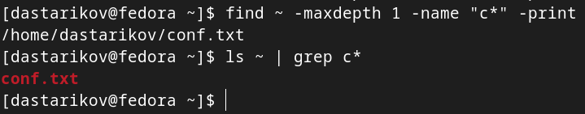{#fig:fig04}
    
4. Вывели на экран (по странично) имена файлов из каталога `/etc`, начинающиеся с символа `"h"` командой `find /etc -name "h*" -print | less` (Рис. [-@fig:fig05])

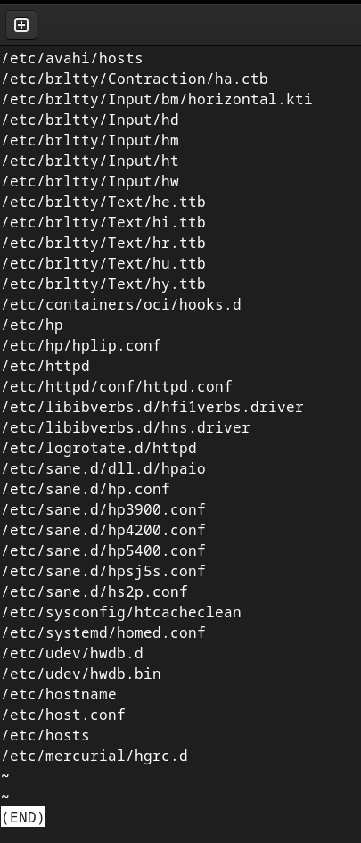{#fig:fig05}

5. Запустили в фоновом режиме процесс, который записывает в файл `~/logfile` файлы, имена которых начинаются с `"log"`, убедились, что он создался, и затем удалили (Рис. [-@fig:fig06]).

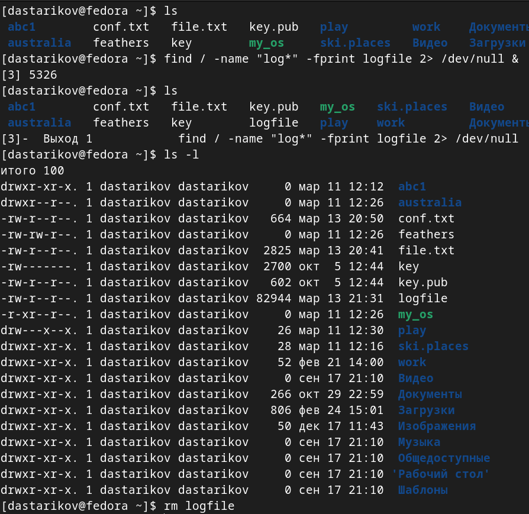{#fig:fig06}

6. Запустили из консоли в фоновом режиме редактор `gedit`, определили идентификатор процесса `gedit` несколькими способами (Рис. [-@fig:fig07]):
    
    * `ps | grep "gedit"`
    * `jobs -l`
    
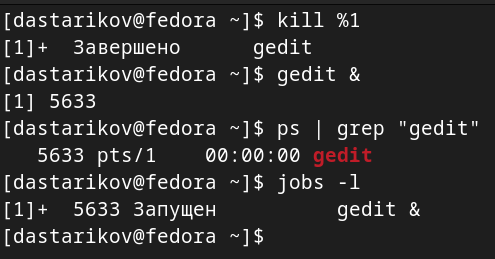{#fig:fig07}
    
7. Прочли справку `man` команды `kill` и использовали ее для завершения процесса `gedit` (Рис. [-@fig:fig08] и [-@fig:fig09]).

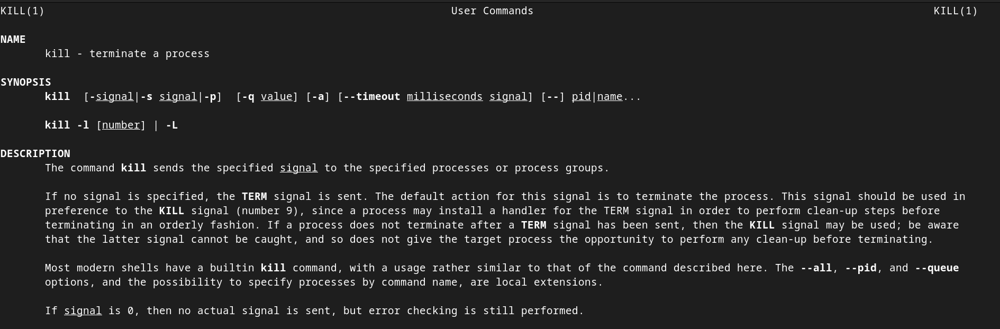{#fig:fig08}

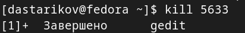{#fig:fig09}

8. Выполнили команды df и du, предварительно получив более подробную информацию об этих командах, с помощью команды man (Рис. [-@fig:fig10]).

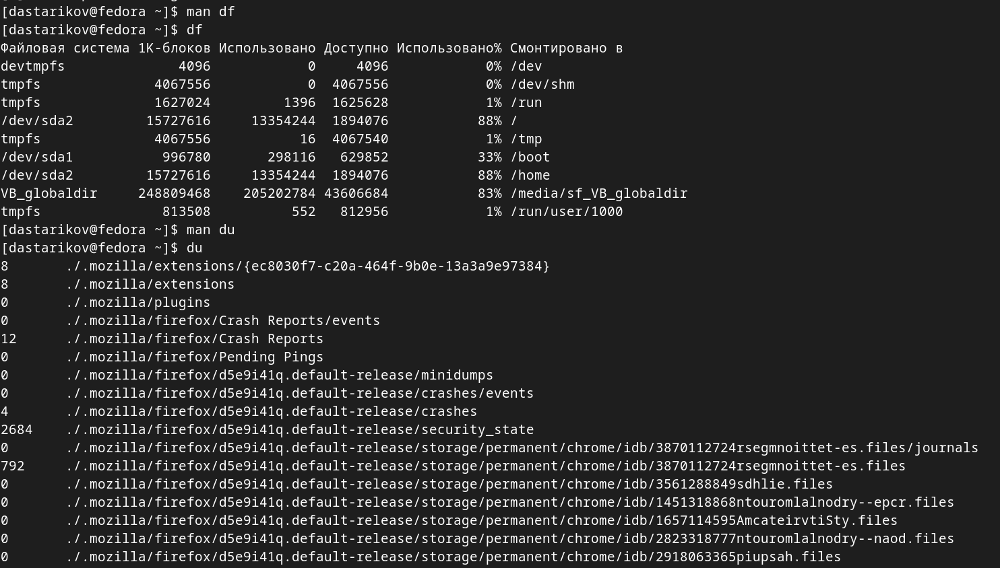{#fig:fig10}

10. Воспользовавшись справкой команды find, вывели имена всех директорий, имеющихся в домашнем каталоге (Рис. [-@fig:fig11])

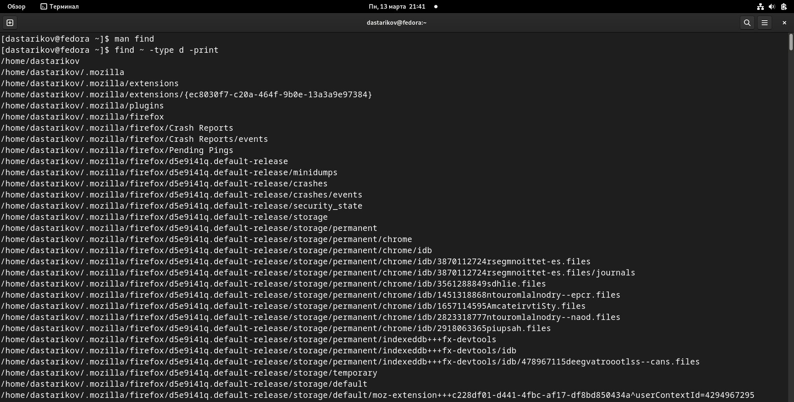{#fig:fig11}

# Выводы

В рамках лабораторной работы познакомились с возможностями записи и фальтрации текстовых данных, перенаправлению потоков ввода/вывода, управлению процессами и работы с дисками.
