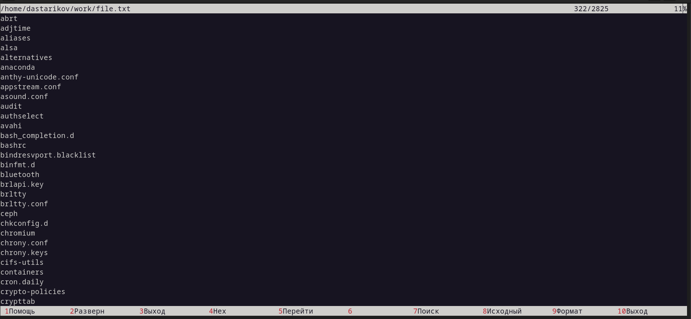
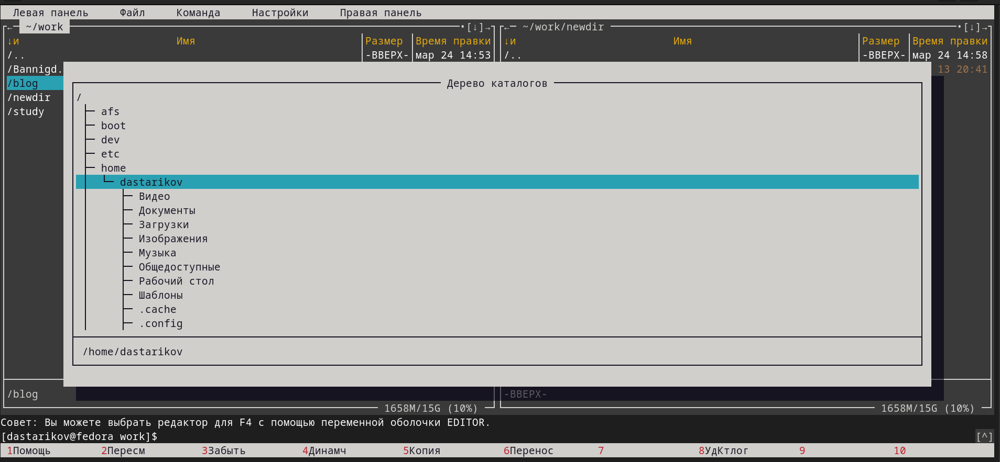

---
## Front matter
lang: ru-RU
title: "Лабораторная работа №7. Командная оболочка Midnight Commander"
subtitle: "Дисциплина: Операционные системы"
author:
  - Стариков Д. А., cтудент НПИбд-02-22
institute:
  - Российский университет дружбы народов, Москва, Россия
date: 24 марта 2023

## i18n babel
babel-lang: russian
babel-otherlangs: english

## Formatting pdf
figureTitle: "Рис."

toc: false
toc-title: Содержание
slide_level: 2
aspectratio: 169
section-titles: true
theme: metropolis
header-includes:
 - \metroset{progressbar=frametitle,sectionpage=progressbar,numbering=fraction}
 - '\makeatletter'
 - '\beamer@ignorenonframefalse'
 - '\makeatother'
---

# Вводная часть

## Цели и задачи

- Освоение основных возможностей командной оболочки Midnight Commander.
- Приобретение навыков практической работы по просмотру каталогов и файлов, манипуляций с ними.

# Заданиe по mc

## Изучили информацию о mc, вызвав в командной строке `man mc`.

{#fig:fig01}

## Запустили из командной строки `mc`, изучите его структуру и меню.

{#fig:fig02}

## Выполнили несколько операций в `mc`, используя управляющие клавиши (операции с панелями; выделение/отмена выделения файлов, копирование/перемещение файлов, получение информации о размере и правах доступа на файлы и/или каталоги и т.п.):

{#fig:fig03 width=80%}

## Выполнили несколько операций в `mc`, используя управляющие клавиши (операции с панелями; выделение/отмена выделения файлов, копирование/перемещение файлов, получение информации о размере и правах доступа на файлы и/или каталоги и т.п.):

{#fig:fig031  width=80%}

## Выполнили основные команды меню левой (или правой) панели.

{#fig:fig32}

## Используя возможности подменю ***Файл***, выполнили:

- просмотр содержимого текстового файла

{#fig:fig05 width=80%}

## Используя возможности подменю ***Файл***, выполнили:

- редактирование содержимого текстового файла (без сохранения результатов редактирования)

{#fig:fig06 width=80%}

## Используя возможности подменю ***Файл***, выполнили:

- создание каталога

{#fig:fig07 width=80%}

## Используя возможности подменю ***Файл***, выполнили:

- копирование в файлов в созданный каталог

{#fig:fig08 width=80%}

## С помощью соответствующих средств подменю ***Команда*** осуществили:

- поиск в файловой системе файла с заданными условиями

{#fig:fig09 width=80%}

## С помощью соответствующих средств подменю ***Команда*** осуществили:

- поиск в файловой системе файла с заданными условиями

{#fig:fig10 width=80%}

## С помощью соответствующих средств подменю ***Команда*** осуществили:

- выбор и повторение одной из предыдущих команд

{#fig:fig11 width=80%}

## С помощью соответствующих средств подменю ***Команда*** осуществили:

- переход в домашний каталог

{#fig:fig12 width=80%}

## С помощью соответствующих средств подменю ***Команда*** осуществили:

- анализ файла меню и файла расширений.

{#fig:fig13 width=80%}

## С помощью соответствующих средств подменю ***Команда*** осуществили:

- анализ файла меню и файла расширений.

{#fig:fig14 width=80%}

## Вызвали подменю ***Настройки*** и освоили операции, определяющие структуру экрана `mc` (Full screen, Double Width, Show Hidden Files и т.д.).

{#fig:fig15}

## Вызвали подменю ***Настройки*** и освоили операции, определяющие структуру экрана `mc` (Full screen, Double Width, Show Hidden Files и т.д.).

{#fig:fig16}

## Вызвали подменю ***Настройки*** и освоили операции, определяющие структуру экрана `mc` (Full screen, Double Width, Show Hidden Files и т.д.).

{#fig:fig17}

# Задание по встроенному редактору mc

## Открыли этот файл с помощью встроенного в `mc` редактора.

{#fig:fig18}

## Вставили в открытый файл небольшой фрагмент текста, скопированный из любого другого файла или Интернета.

{#fig:fig19}

## Проделали с текстом следующие манипуляции, используя горячие клавиши:

- Удалили строку текста

{#fig:fig20 width=80%}

## Проделали с текстом следующие манипуляции, используя горячие клавиши:

- Выделили фрагмент текста и скопировали его на новую строку

{#fig:fig21 width=80%}

## Проделали с текстом следующие манипуляции, используя горячие клавиши:

- Выделили фрагмент текста и перенесли его на новую строку

{#fig:fig211 width=80%}

## Проделали с текстом следующие манипуляции, используя горячие клавиши:

- Сохранили файл.

- Отменили последнее действие

{#fig:fig22 width=80%}

## Проделали с текстом следующие манипуляции, используя горячие клавиши:

- Перешли в конец файла и написали некоторый текст

- Перешли в начало файла (нажав комбинацию клавиш) и напишите некоторый текст

{#fig:fig23 width=80%}

- Сохранили и закрыли файл.

## Открыли файл с исходным текстом на языке программирования `asm`.

{#fig:fig24}

# Выводы

- Освоили основные возможности командной оболочки Midnight Commander.
- Получили навыки практической работы по просмотру каталогов и файлов, манипуляций с ними.
