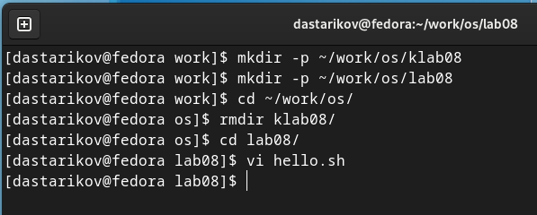
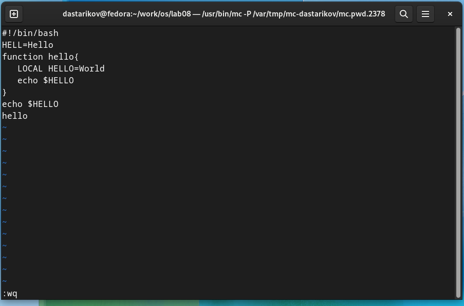
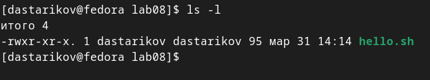
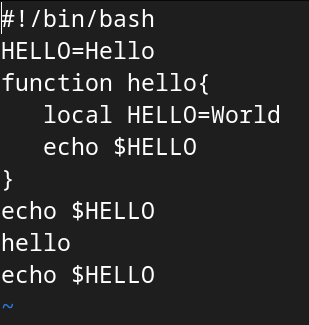

---
## Front matter
lang: ru-RU
title: "Лабораторная работа №8. Текстовый редактор vi."
subtitle: "Дисциплина: Операционные системы"
author:
  - Стариков Д. А., cтудент НПИбд-02-22
institute:
  - Российский университет дружбы народов, Москва, Россия
date: 31 марта 2023

## i18n babel
babel-lang: russian
babel-otherlangs: english

## Formatting pdf
toc: false
toc-title: Содержание
slide_level: 2
aspectratio: 169
section-titles: true
theme: metropolis
header-includes:
 - \metroset{progressbar=frametitle,sectionpage=progressbar,numbering=fraction}
 - '\makeatletter'
 - '\beamer@ignorenonframefalse'
 - '\makeatother'
 
figureTitle: "Рис."
---

# Вводная часть

## Цель работы

Познакомиться с операционной системой Linux. Получить практические навыки работы с редактором vi, установленным по умолчанию практически во всех дистрибутивах.

# Выполнение лабораторной работы

## Задание 1. Создание нового файла с использованием vi
:::::::::::::: {.columns align=center}
::: {.column width="30%"}

1. Создали каталог с именем `~/work/os/lab08`.

2. Перешли в созданный каталог.

3. Вызвали `vi` и создали файл `hello.sh`:

:::
::: {.column width="70%"}

{#fig:fig01}

:::
::::::::::::::

## Задание 1. Создание нового файла с использованием vi

:::::::::::::: {.columns align=center}
::: {.column width="40%"}

4. Нажали клавишу `i` и ввели следующий текст:

5. Нажали клавишу `Esc` для перехода в командный режим после завершения ввода текста.

6. Нажали `:` для перехода в режим последней строки.

7. Нажали `w` (записать) и `q` (выйти), и затем клавишу `Enter` для сохранения текста и завершения работы.

8. Сделайте файл исполняемым:

:::
::: {.column width="60%"}

{#fig:fig02 width=70%}

{#fig:fig03 width=70%}

:::
::::::::::::::

## Задание 2. Редактирование существующего файла

:::::::::::::: {.columns align=center}
::: {.column width="65%"}

1. Установили курсор в конец слова `HELL` второй строки.

2. Перешли в режим вставки и заменили на `HELLO`.

3. Установили курсор на четвертую строку и удалили слово `LOCAL`.

4. Перешли в режим вставки и набрали следующий текст: `local`.

5. Установили курсор на последней строке файла. Вставили после неё строку, содержащую следующий текст: `echo $HELLO`.

6. Удалили последнюю строку.

7. Ввели команду отмены изменений `u` для отмены последней команды.

8. Записали произведённые изменения и вышли из `vi`.

:::
::: {.column width="35%"}

{#fig:fig04 width=65%}

:::
::::::::::::::

# Выводы

## Выводы

В рамках лабораторной работы познакомились с операционной системой Linux, получили практические навыки работы с редактором vi, установленным по умолчанию практически во всех дистрибутивах.
