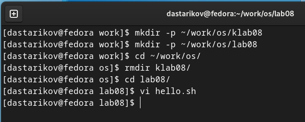
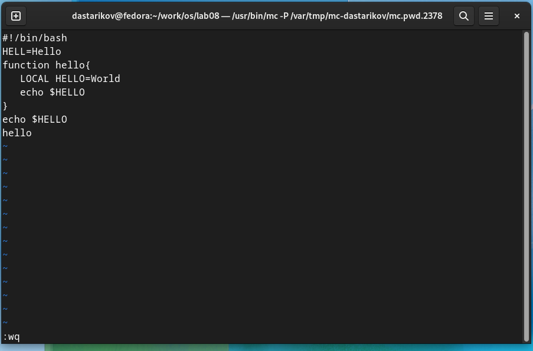
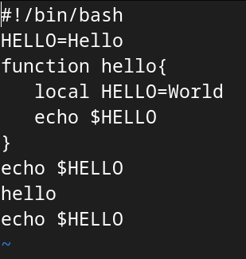

---
## Front matter
title: "Отчет по лабораторной работе №8."
subtitle: "Текстовый редактор vi."
author: "Данила Андреевич Стариков"

## Generic otions
lang: ru-RU
toc-title: "Содержание"

## Bibliography
bibliography: bib/cite.bib
csl: pandoc/csl/gost-r-7-0-5-2008-numeric.csl

## Pdf output format
toc: true # Table of contents
toc-depth: 2
lof: false # List of figures
lot: false # List of tables
fontsize: 12pt
linestretch: 1.5
papersize: a4
documentclass: scrreprt
## I18n polyglossia
polyglossia-lang:
  name: russian
  options:
	- spelling=modern
	- babelshorthands=true
polyglossia-otherlangs:
  name: english
## I18n babel
babel-lang: russian
babel-otherlangs: english
## Fonts
mainfont: PT Serif
romanfont: PT Serif
sansfont: PT Sans
monofont: PT Mono
mainfontoptions: Ligatures=TeX
romanfontoptions: Ligatures=TeX
sansfontoptions: Ligatures=TeX,Scale=MatchLowercase
monofontoptions: Scale=MatchLowercase,Scale=0.9
## Biblatex
biblatex: true
biblio-style: "gost-numeric"
biblatexoptions:
  - parentracker=true
  - backend=biber
  - language=auto
  - autolang=other*
  - citestyle=gost-numeric
## Pandoc-crossref LaTeX customization
figureTitle: "Рис."
tableTitle: "Таблица"
listingTitle: "Листинг"
lofTitle: "Список иллюстраций"
lotTitle: "Список таблиц"
lolTitle: "Листинги"
## Misc options
indent: true
header-includes:
  - \usepackage{indentfirst}
  - \usepackage{float} # keep figures where there are in the text
  - \floatplacement{figure}{H} # keep figures where there are in the text
---

# Цель работы

Познакомиться с операционной системой Linux. Получить практические навыки работы с редактором vi, установленным по умолчанию практически во всех дистрибутивах.

# Выполнение лабораторной работы

## Задание 1. Создание нового файла с использованием vi

1. Создали каталог с именем `~/work/os/lab08` (Рис. [-@fig:fig01]).

2. Перешли в созданный каталог (Рис. [-@fig:fig01]).

3. Вызвали `vi` и создали файл `hello.sh` (Рис. [-@fig:fig01]):

```.bash
vi hello.sh
```

{#fig:fig01}

4. Нажали клавишу `i` и ввели следующий текст (Рис. [-@fig:fig02]):

```.bash
#!/bin/bash
HELL=Hello
function hello {
LOCAL HELLO=World
echo $HELLO
}
echo $HELLO
hello
```

{#fig:fig02}

5. Нажали клавишу `Esc` для перехода в командный режим после завершения ввода текста.

6. Нажали `:` для перехода в режим последней строки.

7. Нажали `w` (записать) и `q` (выйти), и затем клавишу `Enter` для сохранения текста и завершения работы.

8. Сделайте файл исполняемым (Рис. [-@fig:fig03]):

```
chmod +x hello.sh
```

{#fig:fig03}

## Задание 2. Редактирование существующего файла.

1. Вызвали vi на редактирование файла:

```
vi ~/work/os/lab08/hello.sh
```

2. Установили курсор в конец слова `HELL` второй строки.

3. Перешли в режим вставки (клавиша `i`) и заменили на `HELLO`. Нажали `Esc` для возврата в командный режим.

4. Установили курсор на четвертую строку и удалили слово `LOCAL` с помощью комбинации `dw` (delete word).

5. Перешли в режим вставки (клавиша `i`) и набрали следующий текст: `local`, нажали `Esc` для возврата в командный режим.

6. Установили курсор на последней строке файла. Вставили после неё строку, содержащую следующий текст: `echo $HELLO`.

7. Нажали `Esc` для перехода в командный режим.

8. Удалили последнюю строку.

9. Ввели команду отмены изменений `u` для отмены последней команды.

10. Ввели символ `:` для перехода в режим последней строки. Записали произведённые изменения и вышли из vi (`:wq`).

{#fig:fig04}

# Выводы

В рамках лабораторной работы познакомились с операционной системой Linux, получили практические навыки работы с редактором vi, установленным по умолчанию практически во всех дистрибутивах.
