---
## Front matter
lang: ru-RU
title: "Лабораторная работа №9. Текстовый редактор emacs."
subtitle: "Дисциплина: Операционные системы"
author:
  - Стариков Д. А., cтудент НПИбд-02-22
institute:
  - Российский университет дружбы народов, Москва, Россия
date: 08 апреля 2023

## i18n babel
babel-lang: russian
babel-otherlangs: english

## Formatting pdf
toc: false
toc-title: Содержание
slide_level: 2
aspectratio: 169
section-titles: true
theme: metropolis
header-includes:
 - \metroset{progressbar=frametitle,sectionpage=progressbar,numbering=fraction}
 - '\makeatletter'
 - '\beamer@ignorenonframefalse'
 - '\makeatother'
figureTitle: "Рис."
---

# Вводная часть

## Цель работы

Познакомиться с операционной системой `Linux`. Получить практические навыки работы с редактором `Emacs`.

# Выполнение лабораторной работы

## Процедуры редактирования

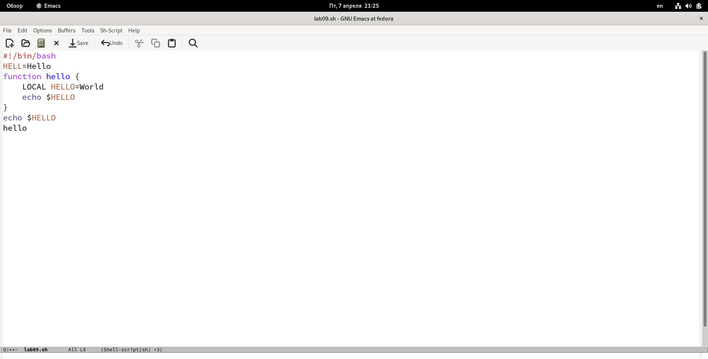{#fig:fig01}

## Процедуры редактирования

:::::::::::::: {.columns align=center}
::: {.column width="50%"}

1. Вырезали одной командой целую строку (`С-k`).

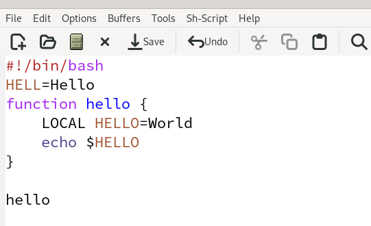{#fig:fig02}

:::
::: {.column width="50%"}

2. Вставили эту строку в конец файла (`C-y`).

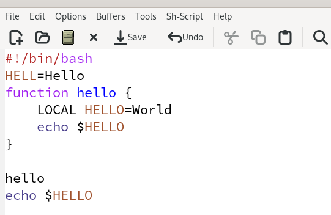{#fig:fig03}

:::
::::::::::::::

## Процедуры редактирования

:::::::::::::: {.columns align=center}
::: {.column width="50%"}

3. Выделили область текста (`C-space`).
4. Скопировали область в буфер обмена (`M-w`).
5. Вставили область в конец файла.

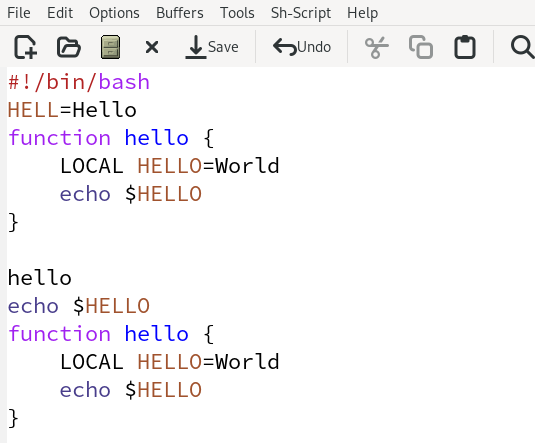{#fig:fig04}

:::
::: {.column width="50%"}

   6. Вновь выделили эту область и на этот раз вырезать её (`C-w`).
   7. Отменили последнее действие (`C-/`).

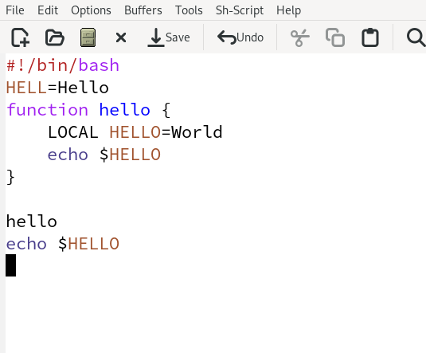{#fig:fig05}

:::
::::::::::::::

## Перемещение курсора

1. Переместили курсор в начало строки (`C-a`).
2. Переместили курсор в конец строки (`C-e`).
3. Переместили курсор в начало буфера (`M-<`).
4. Переместили курсор в конец буфера (`M->`).

## Управление буферами

1. Вывели список активных буферов на экран (`C-x C-b`).
   
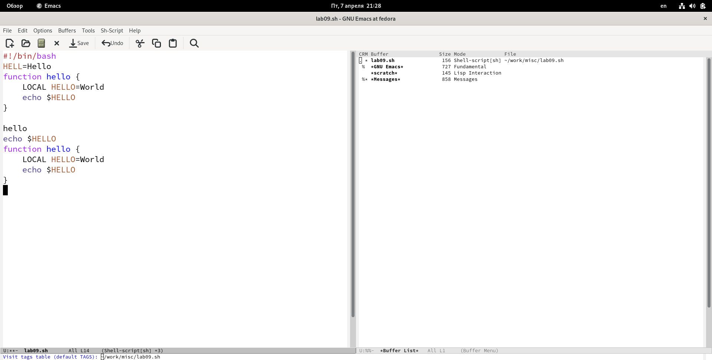{#fig:fig07 width=90%}

## Управление буферами

2. Переместили во вновь открытое окно (`C-x o`) со списком открытых буферов и переключились на другой буфер, нажав на него.

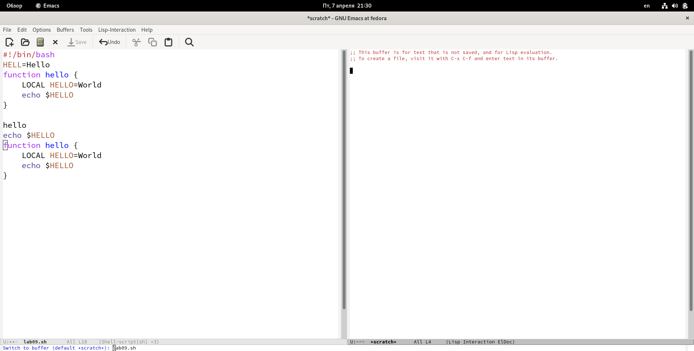{#fig:fig08 width=90%}

## Управление буферами

3. Закрыли это окно (`C-x 0`).
4. Переключились между буферами, но уже без вывода их списка на экран (`C-x b`).

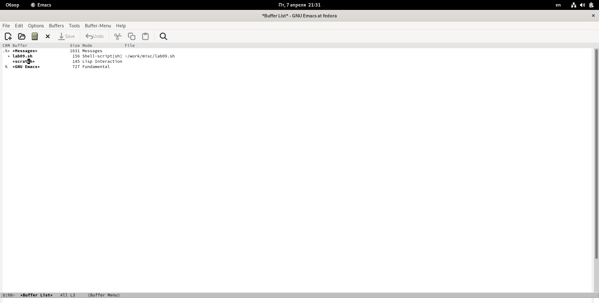{#fig:fig09 width=90%}

## Управление окнами

1. Поделили фрейм на 4 части: разделили фрейм на два окна по вертикали (`C-x 3`), а затем каждое из этих окон на две части по горизонтали (`C-x 2`)
2. В каждом из четырёх созданных окон открыли новый буфер (файл) и ввели несколько строк текста.
   
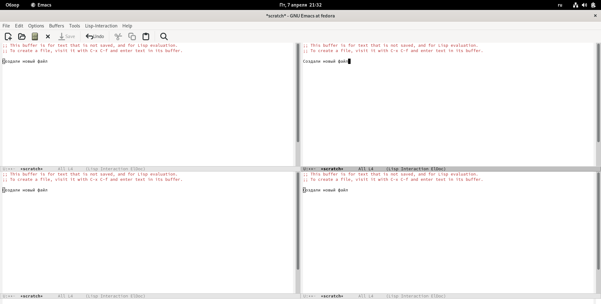{#fig:fig10 width=70%}

## Режим поиска

1. Переключились в режим поиска (`C-s`) и нашли несколько слов, присутствующих в тексте. 

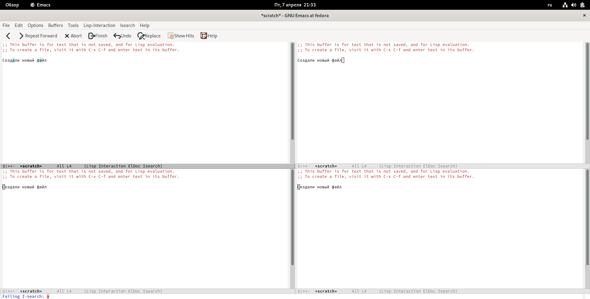{#fig:fig11 width=90%}

## Режим поиска

2. Переключились между результатами поиска, нажимая `C-s`.

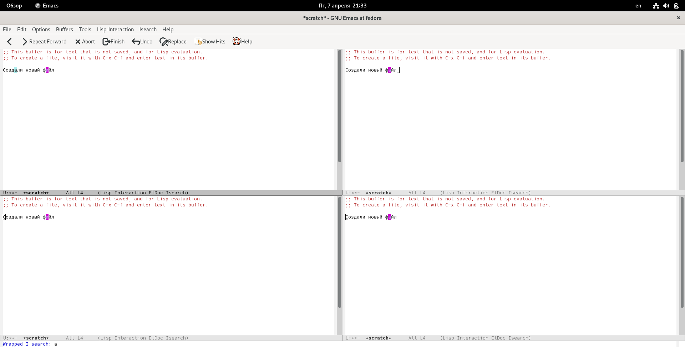{#fig:fig12 width=70%}

## Режим поиска

3. Вышли из режима поиска, нажав `C-g`.
4. Перешли в режим поиска и замены (`M-%`) и заменили `о` на `0`.
5. Попробовали другой режим поиска, нажав `M-s o`. Отличие от первого варианта в возможности использования регулярных выражений (`regular expressions`, `regex` или `regexp`).

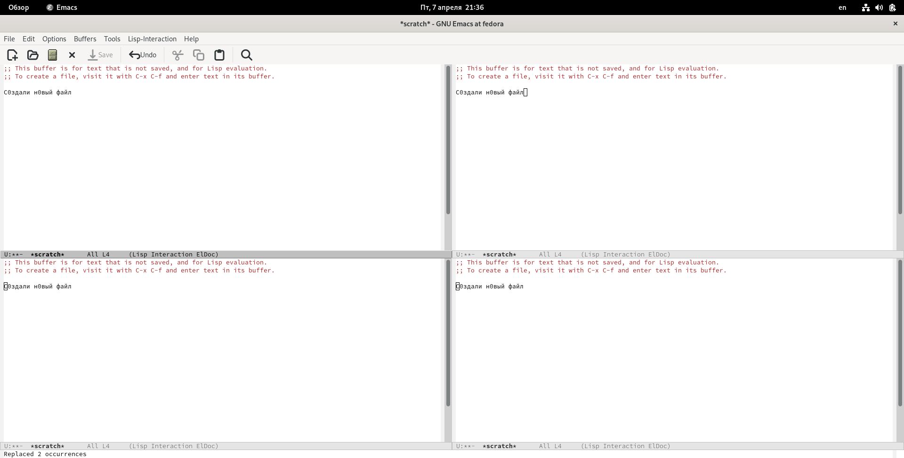{#fig:fig13 width=70%}

# Выводы

## Выводы

В рамках лабораторной работы получили практические навыки работы с текстовым редактором `emacs`.
