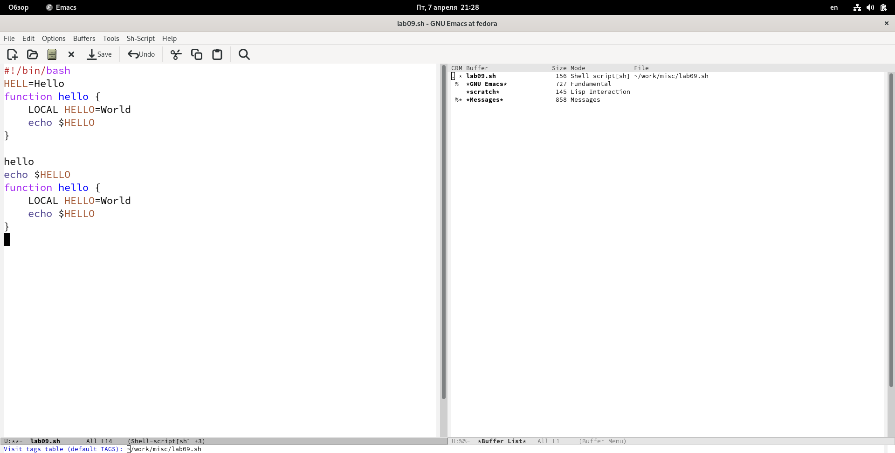

---
## Front matter
title: "Отчет по лабораторной работе №9."
subtitle: "Текстовый редактор emacs."
author: "Данила Андреевич Стариков"

## Generic otions
lang: ru-RU
toc-title: "Содержание"

## Bibliography
bibliography: bib/cite.bib
csl: pandoc/csl/gost-r-7-0-5-2008-numeric.csl

## Pdf output format
toc: true # Table of contents
toc-depth: 2
lof: false # List of figures
lot: false # List of tables
fontsize: 12pt
linestretch: 1.5
papersize: a4
documentclass: scrreprt
## I18n polyglossia
polyglossia-lang:
  name: russian
  options:
	- spelling=modern
	- babelshorthands=true
polyglossia-otherlangs:
  name: english
## I18n babel
babel-lang: russian
babel-otherlangs: english
## Fonts
mainfont: PT Serif
romanfont: PT Serif
sansfont: PT Sans
monofont: PT Mono
mainfontoptions: Ligatures=TeX
romanfontoptions: Ligatures=TeX
sansfontoptions: Ligatures=TeX,Scale=MatchLowercase
monofontoptions: Scale=MatchLowercase,Scale=0.9
## Biblatex
biblatex: true
biblio-style: "gost-numeric"
biblatexoptions:
  - parentracker=true
  - backend=biber
  - hyperref=auto
  - language=auto
  - autolang=other*
  - citestyle=gost-numeric
## Pandoc-crossref LaTeX customization
figureTitle: "Рис."
tableTitle: "Таблица"
listingTitle: "Листинг"
lofTitle: "Список иллюстраций"
lotTitle: "Список таблиц"
lolTitle: "Листинги"
## Misc options
indent: true
header-includes:
  - \usepackage{indentfirst}
  - \usepackage{float} # keep figures where there are in the text
  - \floatplacement{figure}{H} # keep figures where there are in the text
---

# Цель работы

Познакомиться с операционной системой `Linux`. Получить практические навыки работы с редактором `Emacs`.

# Выполнение лабораторной работы

1. Установили редактор `emacs` (`sudo dnf install emacs`) и открыли его.

2. Создали файл `lab07.sh` с помощью комбинации `Ctrl-x` `Ctrl-f` (`C-x C-f`) и набрали текст (Рис. [-@fig:fig01]):

```bash
#!/bin/bash
HELL=Hello
function hello {
   LOCAL HELLO=World
   echo $HELLO
}
echo $HELLO
hello
```

{#fig:fig01}

3. Сохранили файл с помощью комбинации `Ctrl-x` `Ctrl-s` (`C-x C-s`).
4. Выполнили стандартные процедуры редактирования (Рис. [-@fig:fig02], [-@fig:fig03], [-@fig:fig04], [-@fig:fig05], [-@fig:fig06]):
   1. Вырезали одной командой целую строку (`С-k`).
   2. Вставили эту строку в конец файла (`C-y`).
   3. Выделили область текста (`C-space`).
   4. Скопировали область в буфер обмена (`M-w`).
   5. Вставили область в конец файла.
   6. Вновь выделили эту область и на этот раз вырезать её (`C-w`).
   7. Отменили последнее действие (`C-/`).
  
{#fig:fig02 width=70%}

{#fig:fig03 width=70%}

{#fig:fig04 width=70%}

{#fig:fig05 width=70%}

{#fig:fig06 width=70%}

5. Использование команд по перемещению курсора.
   1. Переместили курсор в начало строки (`C-a`).
   2. Переместили курсор в конец строки (`C-e`).
   3. Переместили курсор в начало буфера (`M-<`).
   4. Переместили курсор в конец буфера (`M->`).
6. Управление буферами (Рис. [-@fig:fig07], [-@fig:fig08], [-@fig:fig09]).
   1. Вывели список активных буферов на экран (`C-x C-b`).
   2. Переместили во вновь открытое окно (`C-x o`) со списком открытых буферов и переключились на другой буфер, нажав на него.
   3. Закрыли это окно (`C-x 0`).
   4. Переключились между буферами, но уже без вывода их списка на экран (`C-x b`).

{#fig:fig07 width=90%}

{#fig:fig08 width=90%}

{#fig:fig09 width=90%}

7. Управление окнами (Рис. [-@fig:fig10]).
   1. Поделили фрейм на 4 части: разделили фрейм на два окна по вертикали (`C-x 3`), а затем каждое из этих окон на две части по горизонтали (`C-x 2`)
   2. В каждом из четырёх созданных окон открыли новый буфер (файл) и ввели несколько строк текста.
   
{#fig:fig10 width=90%}

8. Режим поиска (Рис. [-@fig:fig11], [-@fig:fig12], [-@fig:fig13])
   1. Переключились в режим поиска (`C-s`) и нашли несколько слов, присутствующих в тексте. 
   2. Переключились между результатами поиска, нажимая `C-s`.
   3. Вышли из режима поиска, нажав `C-g`.
   4. Перешли в режим поиска и замены (`M-%`) и заменили `о` на `0`.
   5. Попробовали другой режим поиска, нажав `M-s o`. Отличие от первого варианта в возможности использования регулярных выражений (`regular expressions`, `regex` или `regexp`).

{#fig:fig11 width=90%}

{#fig:fig12 width=90%}

{#fig:fig13 width=90%}

# Выводы

В рамках лабораторной работы получили практические навыки работы с текстовым редактором `emacs`.
