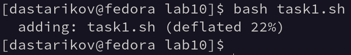
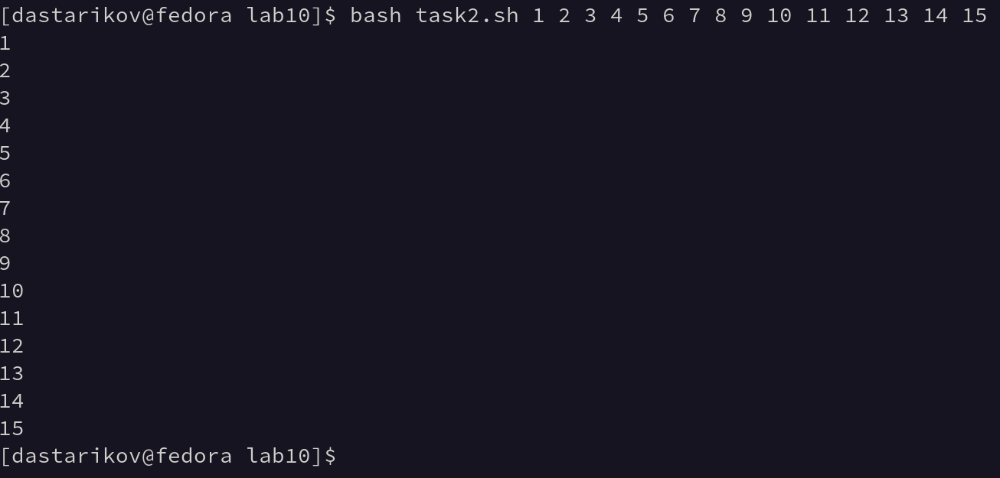
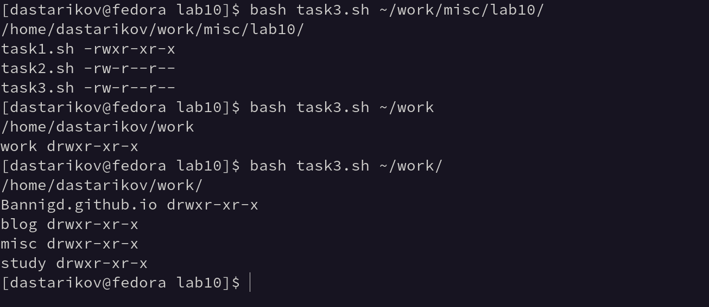
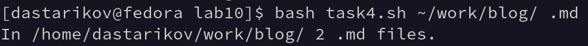

---
## Front matter
lang: ru-RU
title: "Лабораторная работа №10. Программирование в командном процессоре ОС UNIX. Командные файлы."
subtitle: "Дисциплина: Операционные системы"
author:
  - Стариков Д. А., cтудент НПИбд-02-22
institute:
  - Российский университет дружбы народов, Москва, Россия
date: 15 апреля 2023

## i18n babel
babel-lang: russian
babel-otherlangs: english

## Formatting pdf
toc: false
toc-title: Содержание
slide_level: 2
aspectratio: 169
section-titles: true
theme: metropolis
header-includes:
 - \metroset{progressbar=frametitle,sectionpage=progressbar,numbering=fraction}
 - '\makeatletter'
 - '\beamer@ignorenonframefalse'
 - '\makeatother'
---

# Вводная часть

## Цели и задачи

- Изучить основы программирования в оболочке ОС UNIX/Linux
- Научиться писать небольшие командные файлы.

# Выполнение лабораторной работы

## Задание №1.

:::::::::::::: {.columns align=center}
::: {.column width="50%"}

Написали скрипт `task1.sh`, который при запуске будет делать резервную копию самого себя в другую директорию `~/backup/`. Файл архивируется с помощью архиватора `zip`. 

```bash
name=${0}
zip ${name%.*} $name
mv ${name%.*}.zip ~/backup
```

:::
::: {.column width="50%"}

{#fig:fig01}

:::
::::::::::::::

## Задание №2.

:::::::::::::: {.columns align=center}
::: {.column width="50%"}

Написали командный файл `task2.sh`, который обрабатывает произвольное число аргументов командной строки (больше 10), печатая каждый аргумент в консоль


```bash
for i
  do 
  echo $i
  shift
done
```

:::
::: {.column width="50%"}

{#fig:fig03}

:::
::::::::::::::

## Задание №3.


:::::::::::::: {.columns align=center}
::: {.column width="60%"}

Написали командный файл `task3.sh`, который работает аналогично команде `ls`: печатает все файлы и подкаталоги каталога, заданного как аргумент командной строки, и уровни доступа к ним.


```bash
directory=$1
echo $directory
for file in $directory*
do
  echo -n "${file##*/} "; stat -c %A $file 
done
```

:::
::: {.column width="40%"}

{#fig:fig04}

:::
::::::::::::::

## Задание №4.

Написали командный файл `task4.sh`, который получает в качестве аргумента командной строки формат файла и вычисляет количество таких файлов в указанной директории.

:::::::::::::: {.columns align=center}
::: {.column width="60%"}

```bash
directory=$1
extension=$2
let count=0
for file in $directory*
  do 
  if [[ ".${file##*.}" == "$extension" ]]	
  then 
    (( count++ ))
  fi
done
echo In $directory $count $extension files.
```

:::
::: {.column width="40%"}

{#fig:fig05}

:::
::::::::::::::


# Выводы

В рамках лабораторной работы изучили основы программирования в оболочке ОС UNIX/Linux и научились писать небольшие командные файлы.
