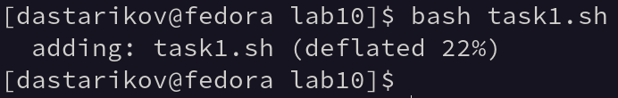
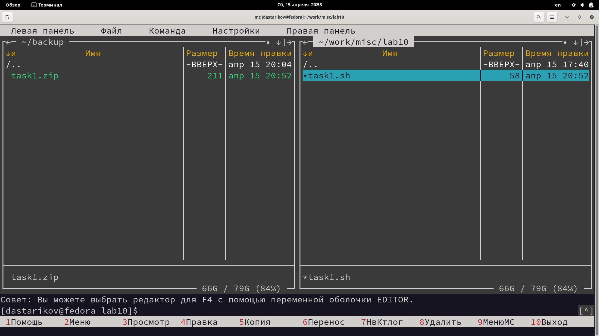
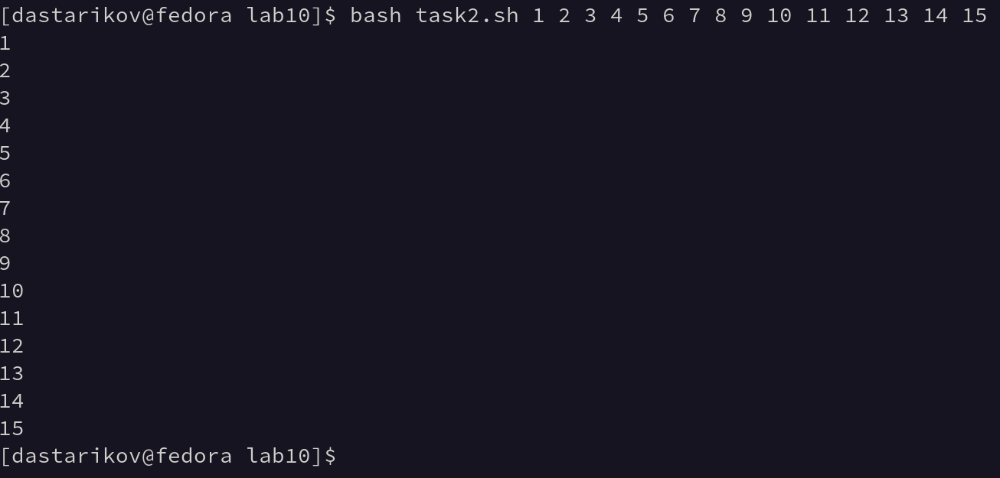
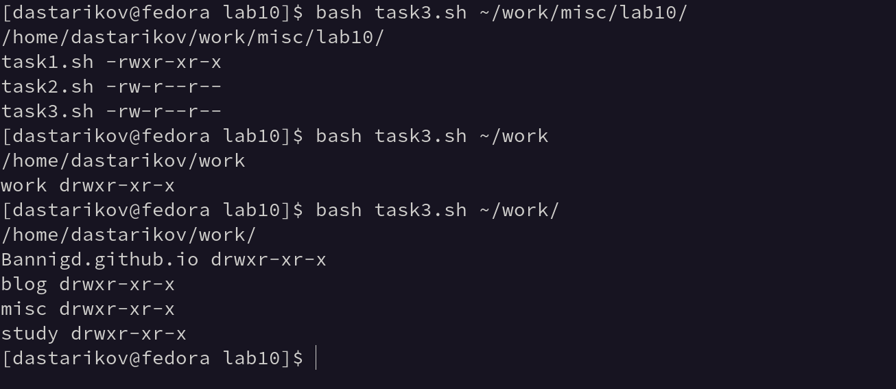
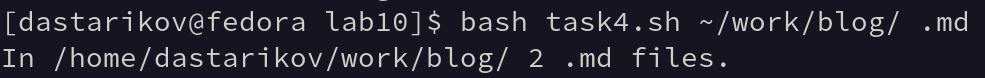

---
## Front matter
title: "Отчет по лабораторной работе №10."
subtitle: "Программирование в командном процессоре ОС UNIX. Командные файлы."
author: "Данила Андреевич Стариков"


## Generic otions
lang: ru-RU
toc-title: "Содержание"

## Bibliography
bibliography: bib/cite.bib
csl: pandoc/csl/gost-r-7-0-5-2008-numeric.csl

## Pdf output format
toc: true # Table of contents
toc-depth: 2
lof: false # List of figures
lot: false # List of tables
fontsize: 12pt
linestretch: 1.5
papersize: a4
documentclass: scrreprt
## I18n polyglossia
polyglossia-lang:
  name: russian
  options:
	- spelling=modern
	- babelshorthands=true
polyglossia-otherlangs:
  name: english
## I18n babel
babel-lang: russian
babel-otherlangs: english
## Fonts
mainfont: PT Serif
romanfont: PT Serif
sansfont: PT Sans
monofont: PT Mono
mainfontoptions: Ligatures=TeX
romanfontoptions: Ligatures=TeX
sansfontoptions: Ligatures=TeX,Scale=MatchLowercase
monofontoptions: Scale=MatchLowercase,Scale=0.9
## Biblatex
biblatex: true
biblio-style: "gost-numeric"
biblatexoptions:
  - parentracker=true
  - backend=biber
  - hyperref=auto
  - language=auto
  - autolang=other*
  - citestyle=gost-numeric
## Pandoc-crossref LaTeX customization
figureTitle: "Рис."
tableTitle: "Таблица"
listingTitle: "Листинг"
lofTitle: "Список иллюстраций"
lotTitle: "Список таблиц"
lolTitle: "Листинги"
## Misc options
indent: true
header-includes:
  - \usepackage{indentfirst}
  - \usepackage{float} # keep figures where there are in the text
  - \floatplacement{figure}{H} # keep figures where there are in the text
---

# Цель работы

Изучить основы программирования в оболочке ОС UNIX/Linux. Научиться писать небольшие командные файлы.

# Выполнение лабораторной работы

## Задание №1.

Написали скрипт `task1.sh`, который при запуске будет делать резервную копию самого себя в другую директорию `~/backup/`. Файл архивируется с помощью архиватора `zip`, текст командного файла представлен в Листинге [-@lst:lst01], пример работы программы на Рисунке [-@fig:fig01] и [-@fig:fig02].

```{#lst:lst01 .bash caption="Текст командного файла Задания №1." .numberLines}
name=${0}
zip ${name%.*} $name
mv ${name%.*}.zip ~/backup
```

{#fig:fig01}

{#fig:fig02}

## Задание №2.

Написали командный файл `task2.sh`, который обрабатывает произвольное число аргументов командной строки (больше 10), печатая каждый аргумент в консоль. Текст командного файла представлен в Листинге [-@lst:lst02], пример работы программы на Рисунке [-@fig:fig03].

```{#lst:lst02 .bash caption="Текст командного файла Задания №2." .numberLines}
for i
  do 
  echo $i
  shift
done
```

{#fig:fig03}

## Задание №3.

Написали командный файл `task3.sh`, который работает аналогично команде `ls`: печатает все файлы и подкаталоги каталога, заданного как аргумент командной строки, и уровни доступа к ним. Текст командного файла представлен в Листинге [-@lst:lst03], пример работы программы на Рисунке [-@fig:fig04].

```{#lst:lst03 .bash caption="Текст командного файла Задания №3." .numberLines}
directory=$1
echo $directory
for file in $directory*
do
  echo -n "${file##*/} "; stat -c %A $file 
done
```

{#fig:fig04}


## Задание №4.

Написали командный файл `task4.sh`, который получает в качестве аргумента командной строки формат файла (.txt, .doc, .jpg, .pdf и т.д.) и вычисляет количество таких файлов в указанной директории. Текст командного файла представлен в Листинге [-@lst:lst03], пример работы программы на Рисунке [-@fig:fig04].

```{#lst:lst04 .bash caption="Текст командного файла Задания №4." .numberLines}
directory=$1
extension=$2
let count=0
for file in $directory*
  do 
  if [[ ".${file##*.}" == "$extension" ]]	
  then 
    (( count++ ))
  fi
done
echo In $directory $count $extension files.
```

{#fig:fig05}

# Выводы

В рамках лабораторной работы изучили основы программирования в оболочке ОС UNIX/Linux и научились писать небольшие командные файлы.
