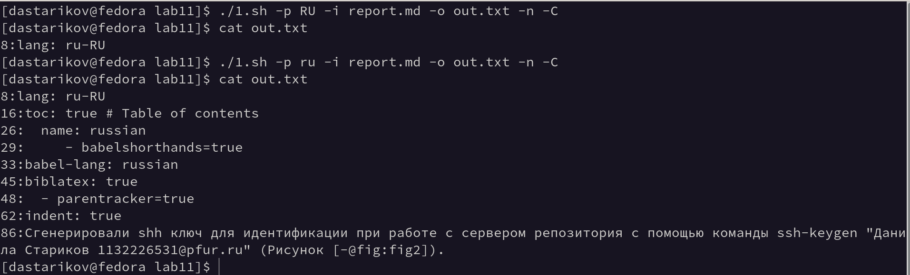
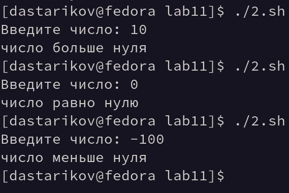
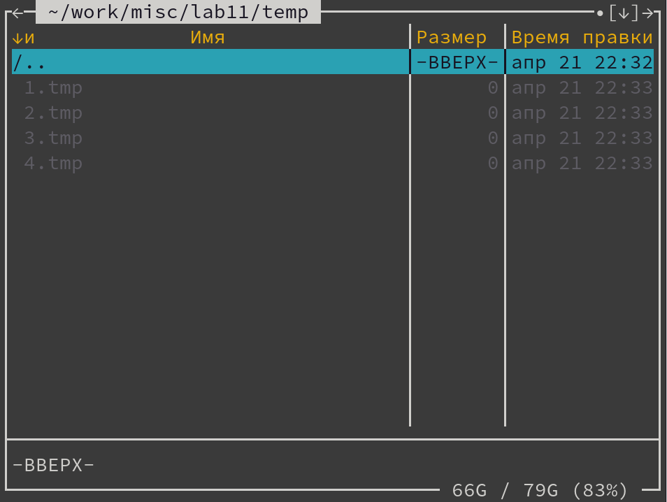
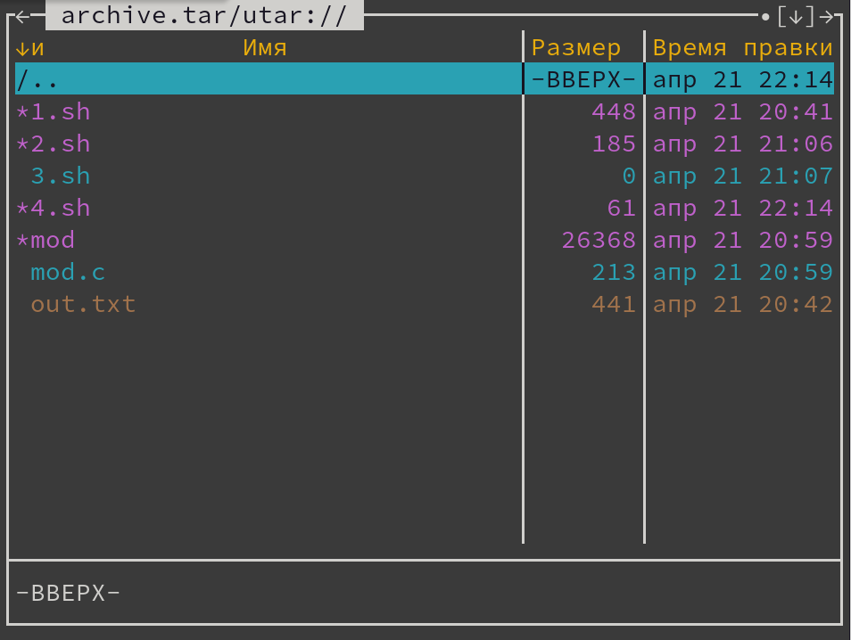

---
## Front matter
lang: ru-RU
title: "Лабораторная работа №11. Программирование в командном процессоре ОС UNIX. Ветвления и циклы"
subtitle: "Дисциплина: Операционные системы"
author:
  - Стариков Д. А., cтудент НПИбд-02-22
institute:
  - Российский университет дружбы народов, Москва, Россия
date: 22 апреля 2023

## i18n babel
babel-lang: russian
babel-otherlangs: english

## Formatting pdf
toc: false
toc-title: Содержание
slide_level: 2
aspectratio: 169
section-titles: true
theme: metropolis
header-includes:
 - \metroset{progressbar=frametitle,sectionpage=progressbar,numbering=fraction}
 - '\makeatletter'
 - '\beamer@ignorenonframefalse'
 - '\makeatother'
---

# Цель работы

Изучить основы программирования в оболочке ОС UNIX. Научиться писать более сложные командные файлы с использованием логических управляющих конструкций и циклов.

# Выполнение лабораторной работы

## Задание 1.

Формулировка задания: Используя команды `getopts grep`, написать командный файл, который анализирует командную строку с ключами:

* `-i` <inputfile> — прочитать данные из указанного файла;
* `-o` <outputfile> — вывести данные в указанный файл;
* `-p` <шаблон> — указать шаблон для поиска;
* `-C` — различать большие и малые буквы;
* `-n` — выдавать номера строк.

а затем ищет в указанном файле нужные строки, определяемые ключом `-p`.

## Задание 1.

:::::::::::::: {.columns align=center}
::: {.column width="50%"}

```{.bash .numberLines}
#!/bin/bash
while getopts i:o:p:Cn optletter
do case $optletter in
i) iflag=1; ival=$OPTARG;;
o) oflag=1; oval=$OPTARG;;
p) pflag=1; pval=$OPTARG;;
C) Cflag=1;;
n) nflag=1;;
*) echo Illegal option $optletter
esac
done
```

:::
::: {.column width="50%"}

```{.bash .numberLines startFrom="12"}
OPTIONS+="-e $pval $ival" 
if [ ! $Cflag ]
then OPTIONS+=" -i"
fi
if [ $nflag ]
then OPTIONS+=" -n"
fi
grep ${OPTIONS} > $oval
```

:::
::::::::::::::

## Задание 1. 

{#fig:fig01}

## Задание 2. 

Формулировка задания: Написать на языке Си программу, которая вводит число и определяет, является ли оно больше нуля, меньше нуля или равно нулю. Затем программа завершается с помощью функции `exit(n)`, передавая информацию в о коде завершения в оболочку. Командный файл должен вызывать эту программу и, проанализировав с помощью команды `$?`, выдать сообщение о том, какое число было введено.

## Задание 2.

```{.c .numberLines}
#include<stdio.h>
#include<stdlib.h>

int main(){
   int n;
   printf("Введите число: ");
   scanf("%d", &n);
   if(n > 0) {n = 1;}
   else if (n<0) {n = -1;}
   else {n=0;}
   exit(n);
   return 0;
}
```

## Задание 2.

```{.bash .numberLines}
#!/bin/bash
./mod
signal=$?
case $signal in
'1') echo число больше нуля;;
'255') echo число меньше нуля;;
'0') echo число равно нулю;
esac
```

## Задание 2. 

{#fig:fig02}


## Задание 3. 
Формулировка задания: Написать командный файл, создающий указанное число файлов, пронумерованных последовательно от 1 до N (например 1.tmp, 2.tmp, 3.tmp,4.tmp и т.д.). Число файлов, которые необходимо создать, передаётся в аргументы командной строки. Этот же командный файл должен уметь удалять все созданные им файлы (если они существуют).

## Задание 3.

```{.bash .numberLines}
#!/bin/bash
N=$1
FILES=
EXTENSION=.tmp
DIR=temp
for (( a=1; a <= N; a++ ))
do
   FILES+=$DIR/${a}${EXTENSION}" "
done
if (! find $DIR -type d 2>/dev/null)
then 
   mkdir $DIR
fi
touch $FILES
```

## Задание 3. 

{#fig:fig04}

## Задание 4. 

Формулировка задания: Написать командный файл, который с помощью команды tar запаковывает в архив все файлы в указанной директории. Модифицировать его так, чтобы запаковывались только те файлы, которые были изменены менее недели тому назад (использовать команду `find`).

## Задание 4. 

```{.bash .numberLines}
#!/bin/bash
tar -c -f archive.tar $(find -type f -mtime -7) 
```



# Выводы

В рамках лабораторной работы начились писать более сложные командные файлы с использованием логических управляющих конструкций и циклов.

