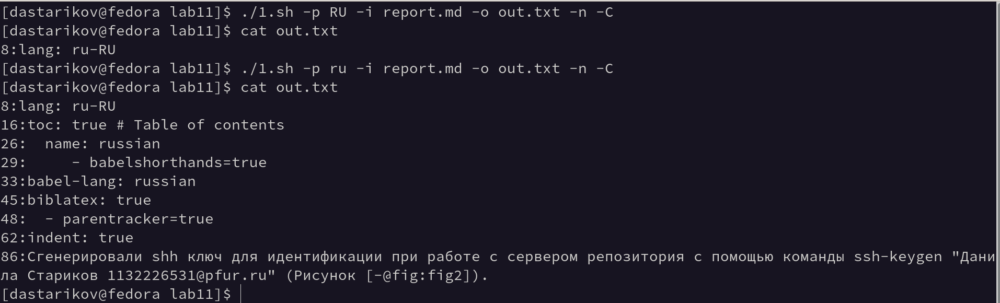
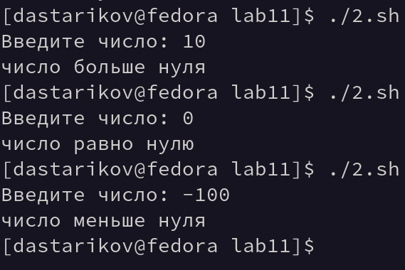
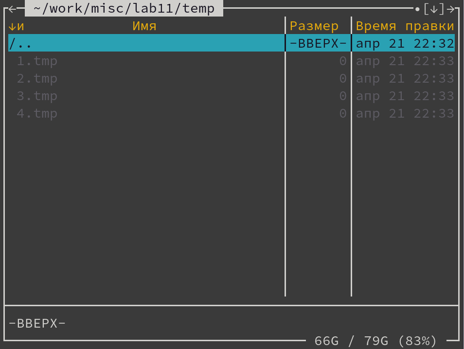
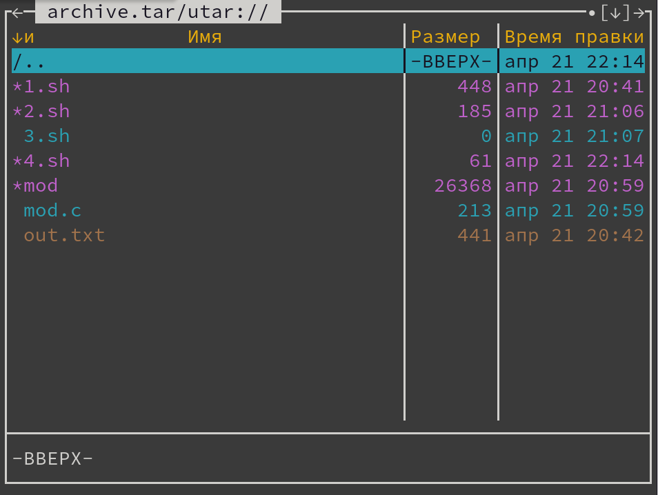

---
## Front matter
title: "Отчет по лабораторной работе №11."
subtitle: "Программирование в командном процессоре ОС UNIX. Ветвления и циклы"
author: "Данила Андреевич Стариков"

## Generic otions
lang: ru-RU
toc-title: "Содержание"

## Bibliography
bibliography: bib/cite.bib
csl: pandoc/csl/gost-r-7-0-5-2008-numeric.csl

## Pdf output format
toc: true # Table of contents
toc-depth: 2
lof: false # List of figures
lot: false # List of tables
fontsize: 12pt
linestretch: 1.5
papersize: a4
documentclass: scrreprt
## I18n polyglossia
polyglossia-lang:
  name: russian
  options:
	- spelling=modern
	- babelshorthands=true
polyglossia-otherlangs:
  name: english
## I18n babel
babel-lang: russian
babel-otherlangs: english
## Fonts
mainfont: PT Serif
romanfont: PT Serif
sansfont: PT Sans
monofont: PT Mono
mainfontoptions: Ligatures=TeX
romanfontoptions: Ligatures=TeX
sansfontoptions: Ligatures=TeX,Scale=MatchLowercase
monofontoptions: Scale=MatchLowercase,Scale=0.9
## Biblatex
biblatex: true
biblio-style: "gost-numeric"
biblatexoptions:
  - parentracker=true
  - backend=biber
  - hyperref=auto
  - language=auto
  - autolang=other*
  - citestyle=gost-numeric
## Pandoc-crossref LaTeX customization
figureTitle: "Рис."
tableTitle: "Таблица"
listingTitle: "Листинг"
lofTitle: "Список иллюстраций"
lotTitle: "Список таблиц"
lolTitle: "Листинги"
## Misc options
indent: true
header-includes:
  - \usepackage{indentfirst}
  - \usepackage{float} # keep figures where there are in the text
  - \floatplacement{figure}{H} # keep figures where there are in the text
---

# Цель работы

Изучить основы программирования в оболочке ОС UNIX. Научиться писать более сложные командные файлы с использованием логических управляющих конструкций и циклов.

# Выполнение лабораторной работы

## Задание 1.

Формулировка задания: Используя команды `getopts grep`, написать командный файл, который анализирует командную строку с ключами:

* `-i` <inputfile> — прочитать данные из указанного файла;
* `-o` <outputfile> — вывести данные в указанный файл;
* `-p` <шаблон> — указать шаблон для поиска;
* `-C` — различать большие и малые буквы;
* `-n` — выдавать номера строк.

а затем ищет в указанном файле нужные строки, определяемые ключом `-p`.

Создан командный файл `1.sh` (Листинг [-@lst:lst01]). Примеры выполнения скрипта представлены на Рисунке [-@fig:fig01].

```{#lst:lst01 .bash caption="Текст командного файла Задания №1." .numberLines}
#!/bin/bash
while getopts i:o:p:Cn optletter
do case $optletter in
i) iflag=1; ival=$OPTARG;;
o) oflag=1; oval=$OPTARG;;
p) pflag=1; pval=$OPTARG;;
C) Cflag=1;;
n) nflag=1;;
*) echo Illegal option $optletter
esac
done
OPTIONS+="-e $pval $ival" 
if [ ! $Cflag ]
then OPTIONS+=" -i"
fi
if [ $nflag ]
then OPTIONS+=" -n"
fi
grep ${OPTIONS} > $oval
```

{#fig:fig01}

## Задание 2. 

Формулировка задания: Написать на языке Си программу, которая вводит число и определяет, является ли оно больше нуля, меньше нуля или равно нулю. Затем программа завершается с помощью функции `exit(n)`, передавая информацию в о коде завершения в оболочку. Командный файл должен вызывать эту программу и, проанализировав с помощью команды `$?`, выдать сообщение о том, какое число было введено.

По заданию написаны 2 программы: `mod.c` на языке Си (Листинг [-@lst:lst02]) и командный файл `2.sh` (Листинг [-@lst:lst03]). Примеры выполнения скрипта представлены на Рисунке [-@fig:fig02].

```{#lst:lst02 .c caption="Текст файла mod.c  Задания №1." .numberLines}
#include<stdio.h>
#include<stdlib.h>

int main(){
   int n;
   printf("Введите число: ");
   scanf("%d", &n);
   if(n > 0) {n = 1;}
   else if (n<0) {n = -1;}
   else {n=0;}
   exit(n);
   return 0;
}
```

```{#lst:lst03 .bash caption="Текст командного файла Задания №2." .numberLines}
#!/bin/bash
./mod
signal=$?
case $signal in
'1') echo число больше нуля;;
'255') echo число меньше нуля;;
'0') echo число равно нулю;
esac
```

{#fig:fig02}


## Задание 3. 
Формулировка задания: Написать командный файл, создающий указанное число файлов, пронумерованных последовательно от 1 до N (например 1.tmp, 2.tmp, 3.tmp,4.tmp и т.д.). Число файлов, которые необходимо создать, передаётся в аргументы командной строки. Этот же командный файл должен уметь удалять все созданные им файлы (если они существуют).

Создан командный файл `1.sh` (Листинг [-@lst:lst04]). Примеры выполнения скрипта представлены на Рисунке [-@fig:fig04].

```{#lst:lst04 .bash caption="Текст командного файла Задания №3." .numberLines}
#!/bin/bash
N=$1
FILES=
EXTENSION=.tmp
DIR=temp
for (( a=1; a <= N; a++ ))
do
   FILES+=$DIR/${a}${EXTENSION}" "
done

if (! find $DIR -type d 2>/dev/null)
then 
   mkdir $DIR
fi

touch $FILES
```

{#fig:fig04}

## Задание 4. 

Формулировка задания: Написать командный файл, который с помощью команды tar запаковывает в архив все файлы в указанной директории. Модифицировать его так, чтобы запаковывались только те файлы, которые были изменены менее недели тому назад (использовать команду `find`).

Создан командный файл `4.sh` (Листинг [-@lst:lst05]). Примеры выполнения скрипта представлены на Рисунке [-@fig:fig03].

```{#lst:lst05 .bash caption="Текст командного файла Задания №4." .numberLines}
#!/bin/bash
tar -c -f archive.tar $(find -type f -mtime -7) 
```

{#fig:fig03}

# Выводы

В рамках лабораторной работы начились писать более сложные командные файлы с использованием логических управляющих конструкций и циклов.

