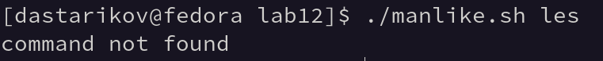
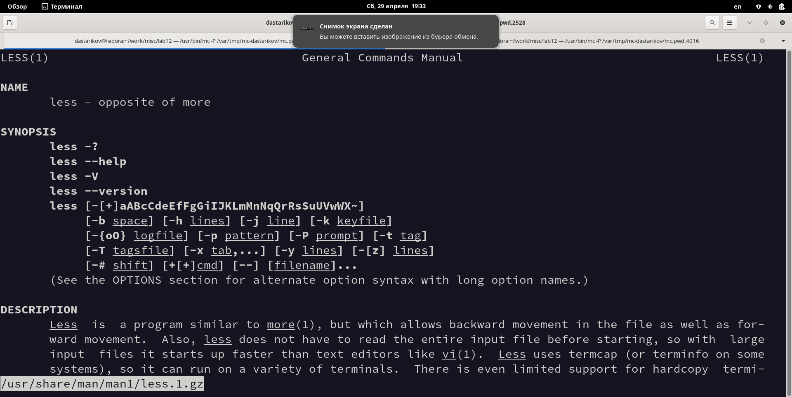
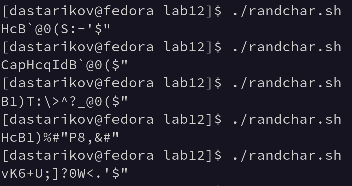

---
## Front matter
lang: ru-RU
title: "Лабораторная работа №12. Программирование в командном процессоре ОС UNIX. Расширенное программирование"
subtitle: "Дисциплина: Операционные системы"
author:
  - Стариков Д. А., cтудент НПИбд-02-22
institute:
  - Российский университет дружбы народов, Москва, Россия
date: 29 апреля 2023

## i18n babel
babel-lang: russian
babel-otherlangs: english

## Formatting pdf
toc: false
toc-title: Содержание
slide_level: 2
aspectratio: 169
section-titles: true
theme: metropolis
header-includes:
 - \metroset{progressbar=frametitle,sectionpage=progressbar,numbering=fraction}
 - '\makeatletter'
 - '\beamer@ignorenonframefalse'
 - '\makeatother'
---

# Цель работы

Изучить основы программирования в оболочке ОС UNIX. Научиться писать более сложные командные файлы с использованием логических управляющих конструкций и циклов.

# Выполнение лабораторной работы

## Задание 1

```{#lst:lst01 .bash caption="Текст командного файла Задания №1." .numberLines}
#!/bin/bash
COMMAND=$1
FILE=`find /usr/share/man/man1 -type f -name $COMMAND.1.gz -print -quit`
if [ -n "$FILE" ]
then 
	less -R /usr/share/man/man1/$COMMAND.1.gz 2>/dev/null
else 
	echo command not found
fi
```
{#fig:fig01 width=70%}

## Задание 1

{#fig:fig02 width=70%} 

## Задание 2

Задание: Используя встроенную переменную `$RANDOM`, напишите командный файл, генерирующий случайную последовательность букв латинского алфавита. Учтите, что `1$RANDOM` выдаёт псевдослучайные числа в диапазоне от `0` до `32767`.

```{#lst:lst02 .bash caption="Текст командного файла Задания №2." .numberLines}
#!/bin/bash
let NUMBER=$RANDOM
while [ ! $NUMBER -eq 0 ]
do
	let VALUE=33+$NUMBER%94
	echo -ne "\x$(printf %02x $VALUE)"
	let NUMBER=$NUMBER/2
done
echo
```

## Задание 2

{#fig:fig03 width=70%}

# Выводы

В рамках лабораторной работы изучены основы программирования в оболочке ОС UNIX. Получены навыки написания более
сложных командных файлов с использованием логических управляющих конструкций и циклов.

