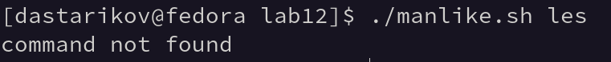
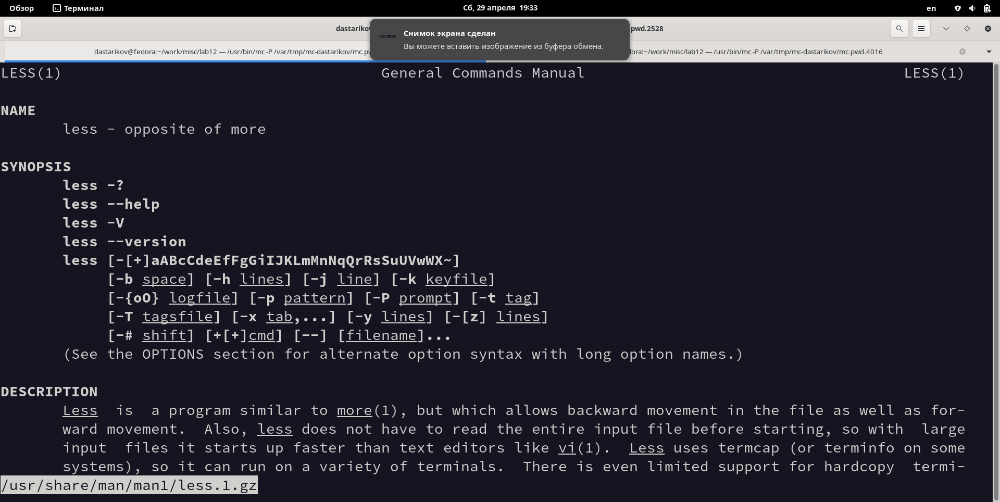
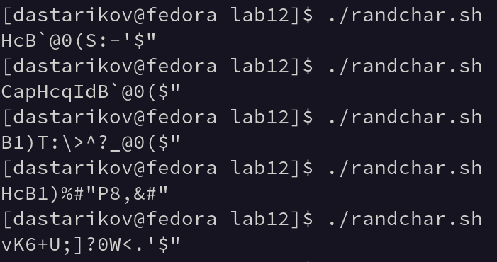

---
## Front matter
title: "Отчет по лабораторной работе №12."
subtitle: "Программирование в командном процессоре ОС UNIX. Расширенное программирование"
author: "Данила Андреевич Стариков"

## Generic otions
lang: ru-RU
toc-title: "Содержание"

## Bibliography
bibliography: bib/cite.bib
csl: pandoc/csl/gost-r-7-0-5-2008-numeric.csl

## Pdf output format
toc: true # Table of contents
toc-depth: 2
lof: false # List of figures
lot: false # List of tables
fontsize: 12pt
linestretch: 1.5
papersize: a4
documentclass: scrreprt
## I18n polyglossia
polyglossia-lang:
  name: russian
  options:
	- spelling=modern
	- babelshorthands=true
polyglossia-otherlangs:
  name: english
## I18n babel
babel-lang: russian
babel-otherlangs: english
## Fonts
mainfont: PT Serif
romanfont: PT Serif
sansfont: PT Sans
monofont: PT Mono
mainfontoptions: Ligatures=TeX
romanfontoptions: Ligatures=TeX
sansfontoptions: Ligatures=TeX,Scale=MatchLowercase
monofontoptions: Scale=MatchLowercase,Scale=0.9
## Biblatex
biblatex: true
biblio-style: "gost-numeric"
biblatexoptions:
  - parentracker=true
  - backend=biber
  - hyperref=auto
  - language=auto
  - autolang=other*
  - citestyle=gost-numeric
## Pandoc-crossref LaTeX customization
figureTitle: "Рис."
tableTitle: "Таблица"
listingTitle: "Листинг"
lofTitle: "Список иллюстраций"
lotTitle: "Список таблиц"
lolTitle: "Листинги"
## Misc options
indent: true
header-includes:
  - \usepackage{indentfirst}
  - \usepackage{float} # keep figures where there are in the text
  - \floatplacement{figure}{H} # keep figures where there are in the text
---

# Цель работы

Изучить основы программирования в оболочке ОС UNIX. Научиться писать более сложные командные файлы с использованием логических управляющих конструкций и циклов.


# Выполнение лабораторной работы

## Задание 1

Задание: Реализовать команду `man` с помощью командного файла. Изучите содержимое каталога `/usr/share/man/man1`. В нем находятся архивы текстовых файлов, содержащих справку по большинству установленных в системе программ и команд. Каждый архив можно открыть командой `less` сразу же просмотрев содержимое справки. Командный файл должен получать в виде аргумента командной строки название команды и в виде результата выдавать справку об этой команде или сообщение об отсутствии справки, если соответствующего файла нет в каталоге `man1`.

Создан командный файл `manlike.sh` (Листинг [-@lst:lst01]). Примеры выполнения скрипта представлены на Рисунках [-@fig:fig01] и  [-@fig:fig02] .

```{#lst:lst01 .bash caption="Текст командного файла Задания №1." .numberLines}
#!/bin/bash

COMMAND=$1
FILE=`find /usr/share/man/man1 -type f -name $COMMAND.1.gz -print -quit`
if [ -n "$FILE" ]
then 
	less -R /usr/share/man/man1/$COMMAND.1.gz 2>/dev/null
else 
	echo command not found
fi
```

{#fig:fig01}

{#fig:fig02}

## Задание 2

Задание: Используя встроенную переменную `$RANDOM`, напишите командный файл, генерирующий случайную последовательность букв латинского алфавита. Учтите, что `$RANDOM` выдаёт псевдослучайные числа в диапазоне от `0` до `32767`.

Создан командный файл `randchar.sh` (Листинг [-@lst:lst02]). Примеры выполнения скрипта представлены на Рисунке [-@fig:fig03].

```{#lst:lst02 .bash caption="Текст командного файла Задания №2." .numberLines}
#!/bin/bash
let NUMBER=$RANDOM
while [ ! $NUMBER -eq 0 ]
do
	let VALUE=33+$NUMBER%94
	echo -ne "\x$(printf %02x $VALUE)"
	let NUMBER=$NUMBER/2
done
echo
```

{#fig:fig03}

# Выводы

В рамках лабораторной работы изучены основы программирования в оболочке ОС UNIX. Получены навыки написания более
сложных командных файлов с использованием логических управляющих конструкций и циклов.

