---
## Front matter
lang: ru-RU
title: "Лабораторная работа №13. Средства, применяемые при разработке программного обеспечения в ОС типа UNIX/Linux."
subtitle: "Дисциплина: Операционные системы"
author:
  - Стариков Д. А., cтудент НПИбд-02-22
institute:
  - Российский университет дружбы народов, Москва, Россия
date: 06 мая 2023

## i18n babel
babel-lang: russian
babel-otherlangs: english

## Formatting pdf
toc: false
toc-title: Содержание
slide_level: 2
aspectratio: 169
section-titles: true
theme: metropolis
header-includes:
 - \metroset{progressbar=frametitle,sectionpage=progressbar,numbering=fraction}
 - '\makeatletter'
 - '\beamer@ignorenonframefalse'
 - '\makeatother'
figureTitle: "Рис."
---

# Цель работы

Приобрести простейшие навыки разработки, анализа, тестирования и отладки приложений в ОС типа UNIX/Linux на примере создания на языке программирования `С` калькулятора с простейшими функциями.

# Выполнение лабораторной работы

## Выполнение лабораторной работы

1. В домашнем каталоге создали подкаталог `~/work/os/lab_prog`, в котором будут храниться файлы с кодом программ.
2. Создали в нём файлы: `calculate.h`, `calculate.c`, `main.c`. Это примитивнейший калькулятор, способный складывать, вычитать, умножать и делить, возводить число в степень, брать квадратный корень, вычислять sin, cos, tan. При запуске он будет запрашивать первое число, операцию, второе число. После этого программа выведет результат и остановится.

## Выполнение лабораторной работы

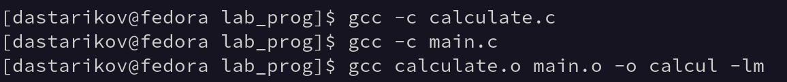{#fig:fig01 width=80%}

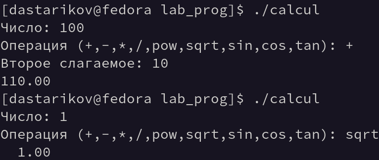{#fig:fig02 width=80%}

## Выполнение лабораторной работы

4. Для упрощения компиляции создали `Makefile`и запустили его, чтобы убедиться в работе

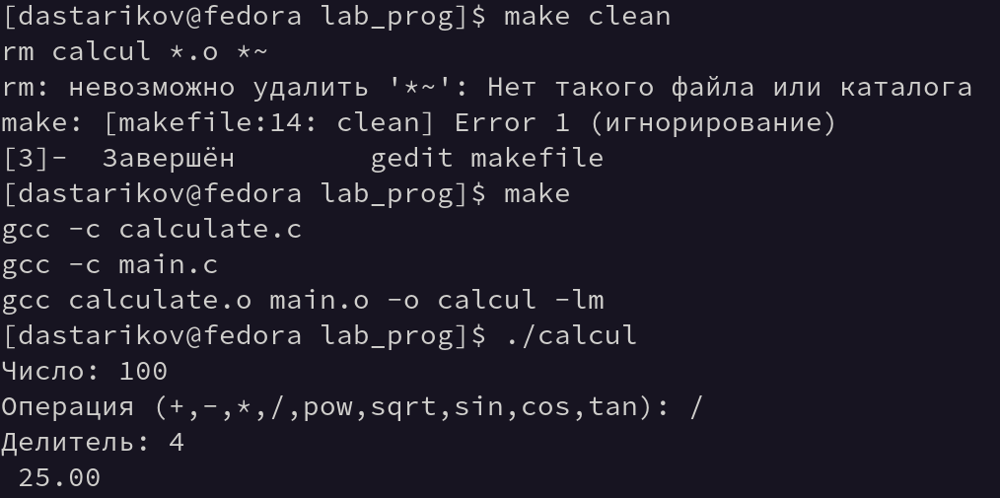{#fig:fig03 width=80%}

## Выполнение лабораторной работы

5. Далее выполнили отладку программы `calcul` с помощью `gdb`:

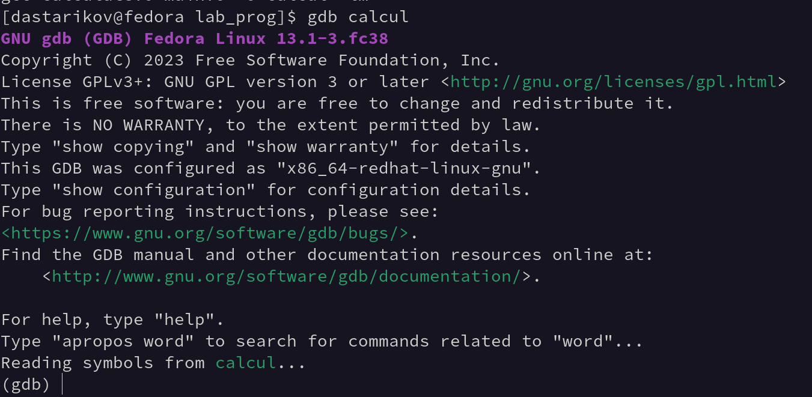{#fig:fig04 width=80%}

## Выполнение лабораторной работы

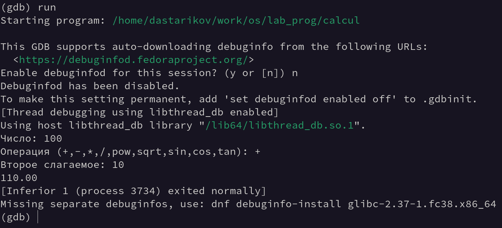{#fig:fig05 width=80%}

## Выполнение лабораторной работы

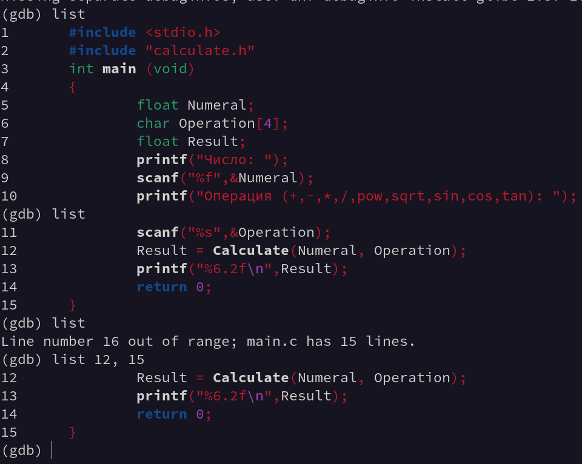{#fig:fig06 width=80%}

## Выполнение лабораторной работы

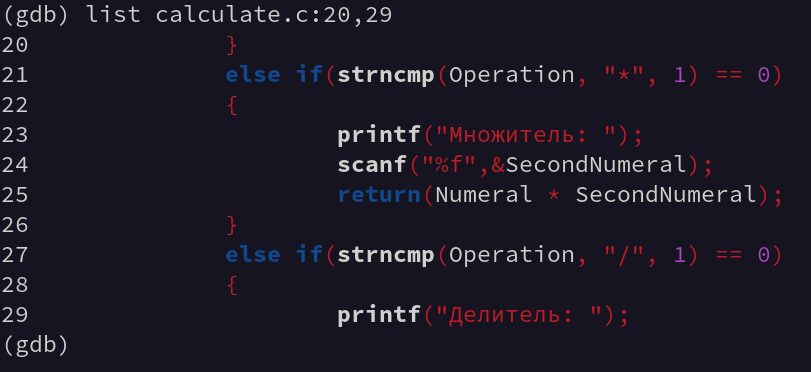{#fig:fig07 width=80%}

## Выполнение лабораторной работы

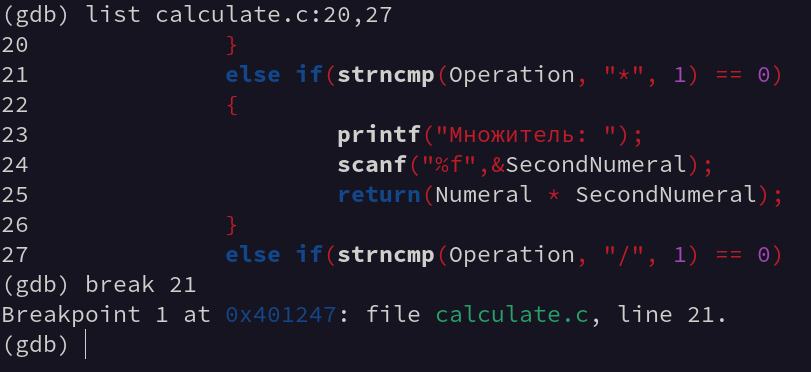{#fig:fig08 width=80%}

## Выполнение лабораторной работы

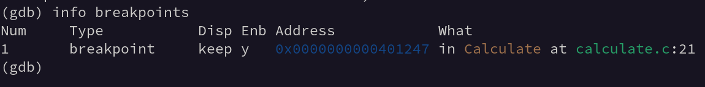{#fig:fig09 width=80%}

## Выполнение лабораторной работы

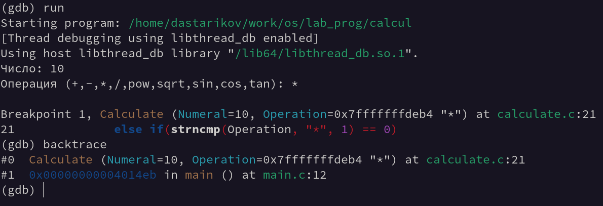{#fig:fig10 width=80%}

## Выполнение лабораторной работы

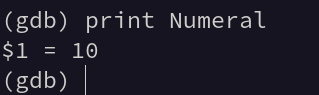{#fig:fig11 width=80%}

## Выполнение лабораторной работы

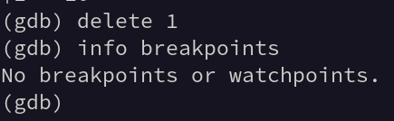{#fig:fig12 width=80%}

## Выполнение лабораторной работы

6. С помощью утилиты `splint` проанализировали коды файлов `calculate.c` и `main.c`.

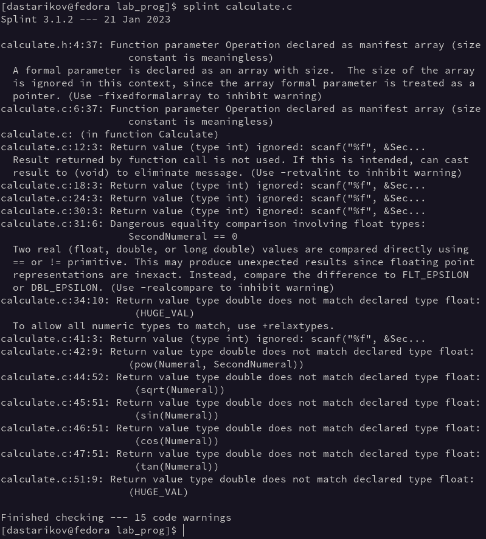{#fig:fig13 width=80%}

## Выполнение лабораторной работы

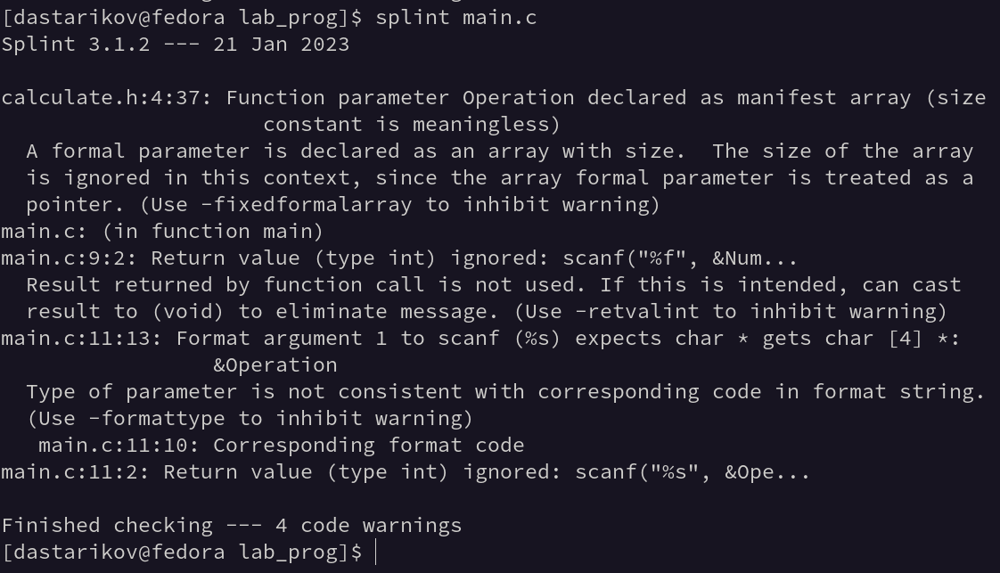{#fig:fig14 width=80%} 

# Выводы

В рамках лабораторной работы получили практические навыки разработик, анализа, тестирования и отладки приложений в ОС типа UNIX/Linux на примере создания на языке программирования `С` калькулятора с простейшими функциями с помощью утилит `dgb` и `splint`.

