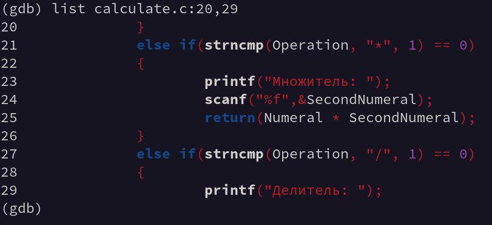

---
## Front matter
title: "Отчет по лабораторной работе №13."
subtitle: "Средства, применяемые при разработке программного обеспечения в ОС типа UNIX/Linux."
author: "Данила Андреевич Стариков"

## Generic otions
lang: ru-RU
toc-title: "Содержание"

## Bibliography
bibliography: bib/cite.bib
csl: pandoc/csl/gost-r-7-0-5-2008-numeric.csl

## Pdf output format
toc: true # Table of contents
toc-depth: 2
lof: false # List of figures
lot: false # List of tables
fontsize: 12pt
linestretch: 1.5
papersize: a4
documentclass: scrreprt
## I18n polyglossia
polyglossia-lang:
  name: russian
  options:
	- spelling=modern
	- babelshorthands=true
polyglossia-otherlangs:
  name: english
## I18n babel
babel-lang: russian
babel-otherlangs: english
## Fonts
mainfont: PT Serif
romanfont: PT Serif
sansfont: PT Sans
monofont: PT Mono
mainfontoptions: Ligatures=TeX
romanfontoptions: Ligatures=TeX
sansfontoptions: Ligatures=TeX,Scale=MatchLowercase
monofontoptions: Scale=MatchLowercase,Scale=0.9
## Biblatex
biblatex: true
biblio-style: "gost-numeric"
biblatexoptions:
  - parentracker=true
  - backend=biber
  - hyperref=auto
  - language=auto
  - autolang=other*
  - citestyle=gost-numeric
## Pandoc-crossref LaTeX customization
figureTitle: "Рис."
tableTitle: "Таблица"
listingTitle: "Листинг"
lofTitle: "Список иллюстраций"
lotTitle: "Список таблиц"
lolTitle: "Листинги"
## Misc options
indent: true
header-includes:
  - \usepackage{indentfirst}
  - \usepackage{float} # keep figures where there are in the text
  - \floatplacement{figure}{H} # keep figures where there are in the text
---

# Цель работы

Приобрести простейшие навыки разработки, анализа, тестирования и отладки приложений в ОС типа UNIX/Linux на примере создания на языке программирования `С` калькулятора с простейшими функциями.

# Выполнение лабораторной работы

1. В домашнем каталоге создали подкаталог `~/work/os/lab_prog`, в котором будут храниться файлы с кодом программ.
2. Создали в нём файлы: `calculate.h` (Листинг [-@lst:lst02]), `calculate.c` (Листинг [-@lst:lst03]), `main.c` (Листинг [-@lst:lst04]). Это примитивнейший калькулятор, способный складывать, вычитать, умножать и делить, возводить число в степень, брать квадратный корень, вычислять sin, cos, tan. При запуске он будет запрашивать первое число, операцию, второе число. После этого программа выведет результат и остановится.

```{#lst:lst01 .C caption="Текст файла calculate.h" .numberLines}
#ifndef CALCULATE_H_
#define CALCULATE_H_

float Calculate(float Numeral, char Operation[4]);

#endif /*CALCULATE_H_*/
```

```{#lst:lst02 .C caption="Текст файла calculate.c" .numberLines}
#include <stdio.h>
#include <math.h>
#include <string.h>
#include "calculate.h"

float Calculate(float Numeral, char Operation[4]) {
	float SecondNumeral;
	if(strncmp(Operation, "+", 1) == 0) {
		printf("Второе слагаемое: ");
		scanf("%f",&SecondNumeral);
		return(Numeral + SecondNumeral);
	}
	else if(strncmp(Operation, "-", 1) == 0) {
		printf("Вычитаемое: ");
		scanf("%f",&SecondNumeral);
		return(Numeral - SecondNumeral);
	}
	else if(strncmp(Operation, "*", 1) == 0) {
		printf("Множитель: ");
		scanf("%f",&SecondNumeral);
		return(Numeral * SecondNumeral);
	}
	else if(strncmp(Operation, "/", 1) == 0) {
		printf("Делитель: ");
		scanf("%f",&SecondNumeral);
		if(SecondNumeral == 0)
		{
			printf("Ошибка: деление на ноль! ");
			return(HUGE_VAL);
		}
		else return(Numeral / SecondNumeral);
	}
	else if(strncmp(Operation, "pow", 3) == 0) {	
		printf("Степень: ");
		scanf("%f",&SecondNumeral);
		return(pow(Numeral, SecondNumeral));
	}
	else if(strncmp(Operation, "sqrt", 4) == 0) return(sqrt(Numeral));
	else if(strncmp(Operation, "sin", 3) == 0) return(sin(Numeral));
	else if(strncmp(Operation, "cos", 3) == 0) return(cos(Numeral));
	else if(strncmp(Operation, "tan", 3) == 0) return(tan(Numeral));
	else {
		printf("Неправильно введено действие ");
		return(HUGE_VAL);
	}
}
```

```{#lst:lst03 .C caption="Текст файла main.c" .numberLines}
#include <stdio.h>
#include "calculate.h"
int main (void)
{
	float Numeral;
	char Operation[4];
	float Result;
	printf("Число: ");
	scanf("%f",&Numeral);
	printf("Операция (+,-,*,/,pow,sqrt,sin,cos,tan): ");
	scanf("%s",&Operation);
	Result = Calculate(Numeral, Operation);
	printf("%6.2f\n",Result);
	return 0;
}
```

3. Выполнили компиляцию программы посредством `gcc` (Рисунок [-@fig:fig01]) и проверили ее работу (Рисунок [-@fig:fig02]). 

{#fig:fig01}

{#fig:fig02}

4. Для упрощения компиляции создали `Makefile` (Листинг [-@lst:lst04]) и запустили его, чтобы убедиться в работе (Рисунок [-@fig:fig03])

```{#lst:lst04 .makefile caption="Текст Makefile-файла" .numberLines}
CC = gcc
CFLAGS =
LIBS = -lm

calcul: calculate.o main.o
		gcc calculate.o main.o -o calcul $(LIBS)

calculate.o: calculate.c calculate.h
		gcc -g -c calculate.c $(CFLAGS)

main.o: main.c calculate.h
		gcc -g -c main.c $(CFLAGS)
clean:
		-rm calcul *.o *~
```

{#fig:fig03}

5. Далее выполнили отладку программы `calcul` с помощью `gdb` (Рис. [-@fig:fig04], [-@fig:fig12]):

{#fig:fig04}

{#fig:fig05}

{#fig:fig06}

{#fig:fig07}

{#fig:fig08}

{#fig:fig09}

{#fig:fig10}

{#fig:fig11}

{#fig:fig12}

6. С помощью утилиты `splint` проанализировали коды файлов `calculate.c` и `main.c` (Рис. [-@fig:fig13], [-@fig:fig14]).

{#fig:fig13}

{#fig:fig14}
 
# Выводы

В рамках лабораторной работы получили практические навыки разработик, анализа, тестирования и отладки приложений в ОС типа UNIX/Linux на примере создания на языке программирования `С` калькулятора с простейшими функциями с помощью утилит `dgb` и `splint`.
