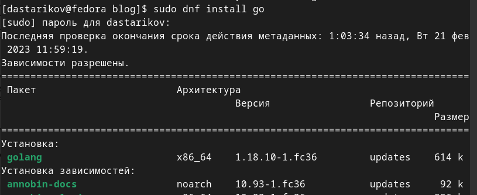
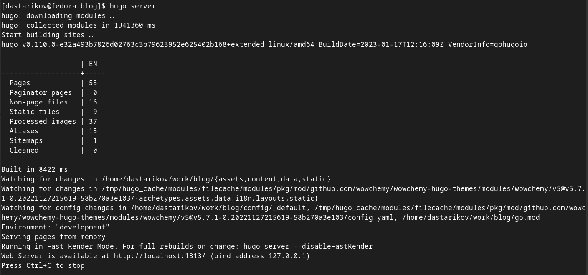

---
## Front matter
lang: ru-RU
title: "Персональный сайт научного работника. Этап 1"
subtitle: "Дисциплина: Операционные системы"
author:
  - Стариков Д. А., cтудент НПИбд-02-22
institute:
  - Российский университет дружбы народов, Москва, Россия
date: 21 февраля 2023

## i18n babel
babel-lang: russian
babel-otherlangs: english

## Formatting pdf
toc: false
toc-title: Содержание
slide_level: 2
aspectratio: 169
section-titles: true
theme: metropolis
header-includes:
 - \metroset{progressbar=frametitle,sectionpage=progressbar,numbering=fraction}
 - '\makeatletter'
 - '\beamer@ignorenonframefalse'
 - '\makeatother'
 
## Pandoc-crossref LaTeX customization
figureTitle: "Рисунок" 
---

# Вводная часть

## Цели и задачи

- Познакомиться с статическим генератором сайтов `Hugo`
- Скопировать шаблон сайта научного сотрудника
- Разместить заготовку на Github pages

# Выполнение лабораторной работы

## Установка ПО

:::::::::::::: {.columns align=top}
::: {.column}

Дистрибутив Hugo https://github.com/gohugoio/hugo/releases.

:::
::: {.column}

Установка Go.

:::
::::::::::::::

## Копирование репозитория шаблона сайта

1. Создание собственного репозитория на основе шаблона .

## Копирование репозитория шаблона сайта

2. Клонирование созданного репозитория в каталог `blog` на ПК.

## Копирование репозитория шаблона сайта

3. Проверка работы репозитория - запуск локального сервера сайта

## Размещение заготовки сайта на Github pages

1. Создание нового репозитория с именем `Bannigd.github.io` (соответствует адресу сайта).

## Размещение заготовки сайта на Github pages

2. Создание копия репозитория `Bannigd.github.io` в подкаталоге `public` каталога `blog`.

## Размещение заготовки сайта на Github pages

3. Генерация сайта.

:::::::::::::: {.columns align=center}
::: {.column}

:::
::: {.column}

:::
::::::::::::::

# Выводы

- Познакомились с генератором сайтов `Hugo`
- Разместили заготовку для персонального сайта на `Github Pages`

