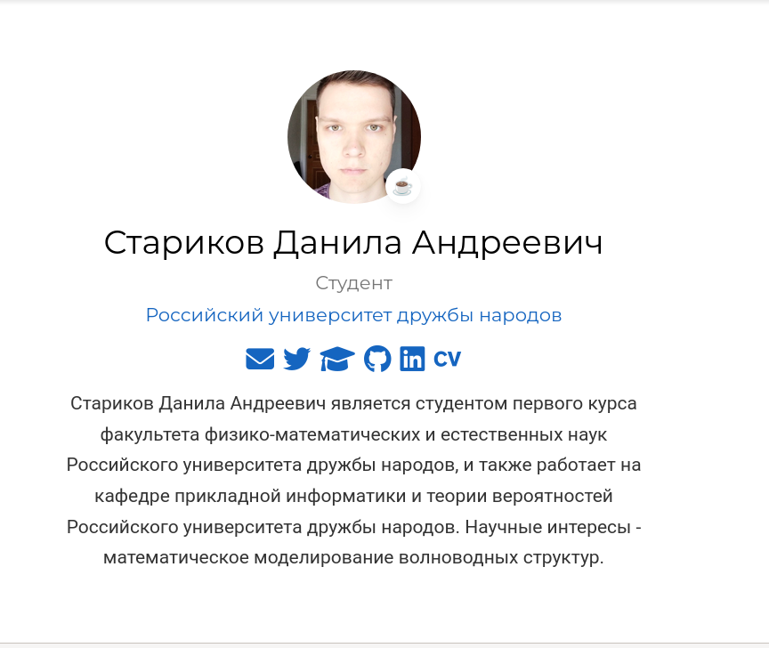
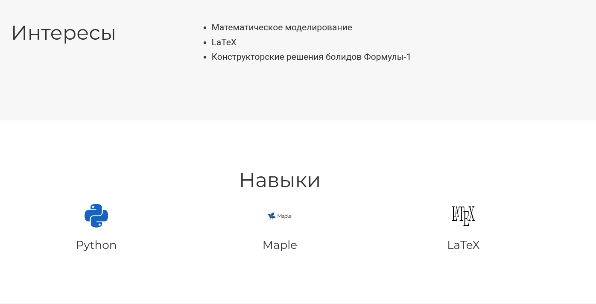
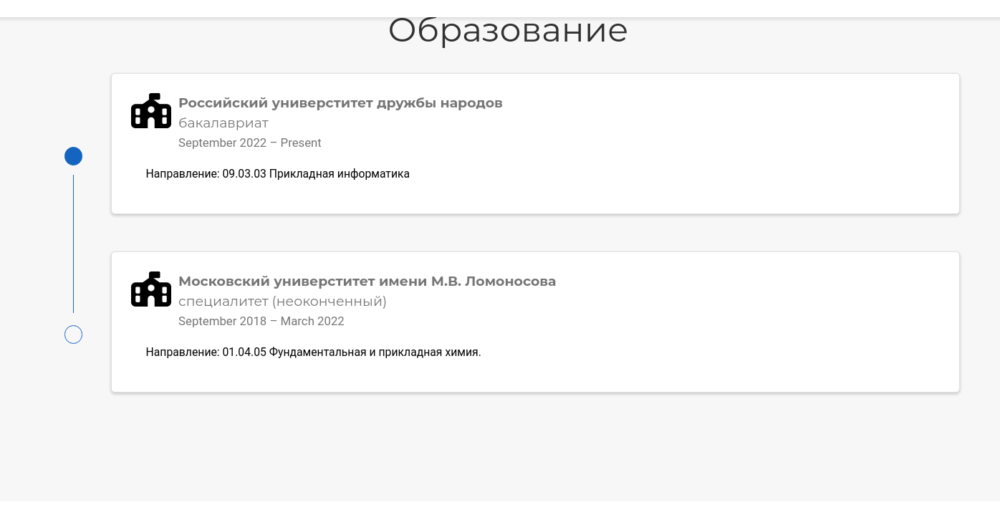
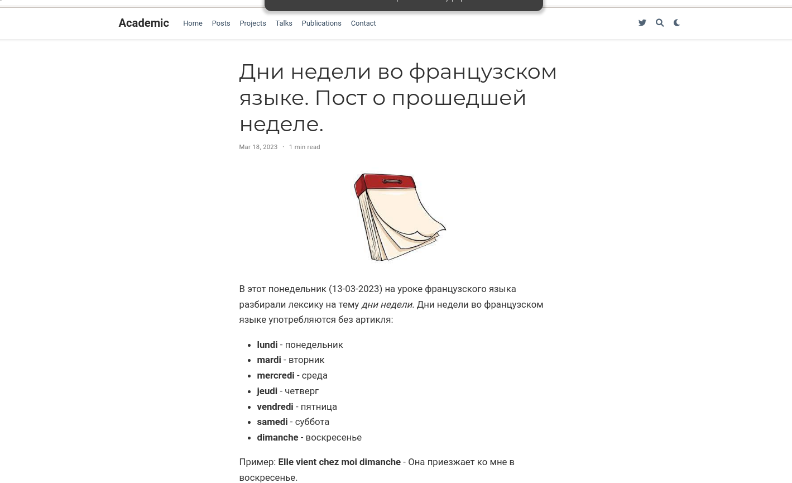
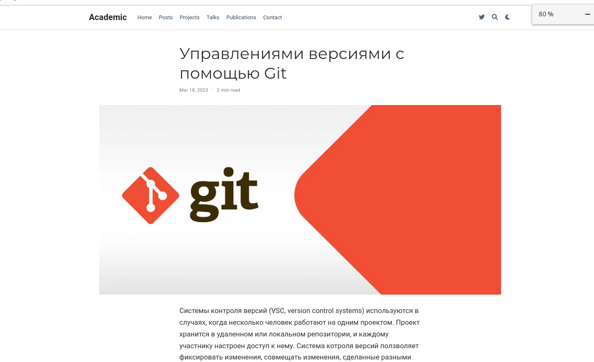

---
## Front matter
lang: ru-RU
title: "Персональный сайт научного работника. Этап 2"
subtitle: "Дисциплина: Операционные системы"
author:
  - Стариков Д. А., cтудент НПИбд-02-22
institute:
  - Российский университет дружбы народов, Москва, Россия
date: 18 марта 2023

## i18n babel
babel-lang: russian
babel-otherlangs: english

## Formatting pdf
toc: false
toc-title: Содержание
slide_level: 2
aspectratio: 169
section-titles: true
theme: metropolis
header-includes:
 - \metroset{progressbar=frametitle,sectionpage=progressbar,numbering=fraction}
 - '\makeatletter'
 - '\beamer@ignorenonframefalse'
 - '\makeatother'
 
figureTitle: "Рис."
---

# Вводная часть

## Цели и задачи

Добавить к сайту данные о себе.

- Список добавляемых данных:

* Разместить фотографию владельца сайта.
* Разместить краткое описание владельца сайта (Biography).
* Добавить информацию об интересах (Interests).
* Добавить информацию об образовании (Education).
* Сделать пост по прошедшей неделе.
* Добавить пост на тему по выбору: Управление версиями. Git.

# Выполнение этапа 2.

## Разместить фотографию владельца сайта.

{#fig:fig01 width=50%} 

## Разместить краткое описание владельца сайта (Biography).

{#fig:fig011 width=50%} 

## Добавить информацию об интересах (Interests).

{#fig:fig02 width=70%} 

## Добавить информацию об образовании (Education).

{#fig:fig03 width=70%} 

## Сделать пост по прошедшей неделе.

{#fig:fig04 width=70%} 

## Добавить пост на тему по выбору: Управление версиями. Git.

{#fig:fig05 width=70%} 

# Выводы

В рамках второго этапа персонального проекта заполнили начальную информацию о владельце сайта и написали 2 поста.
