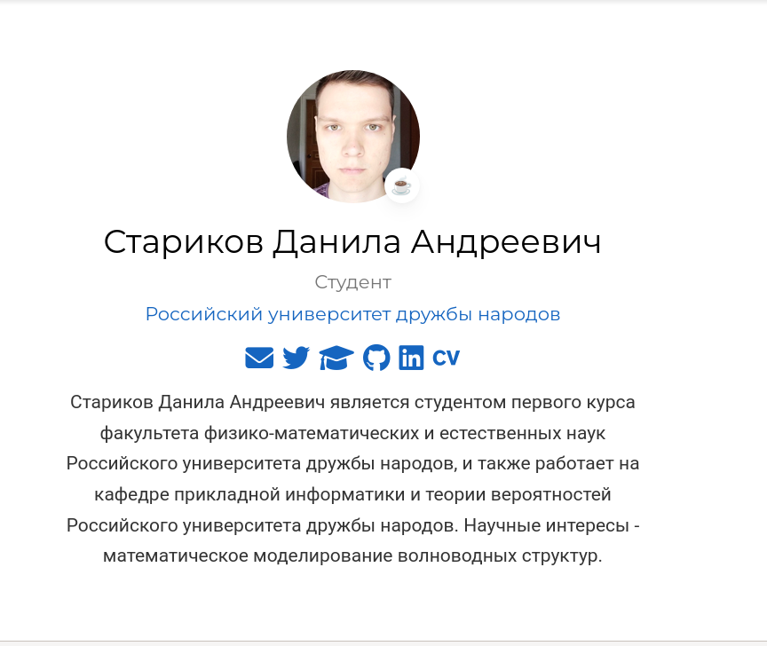
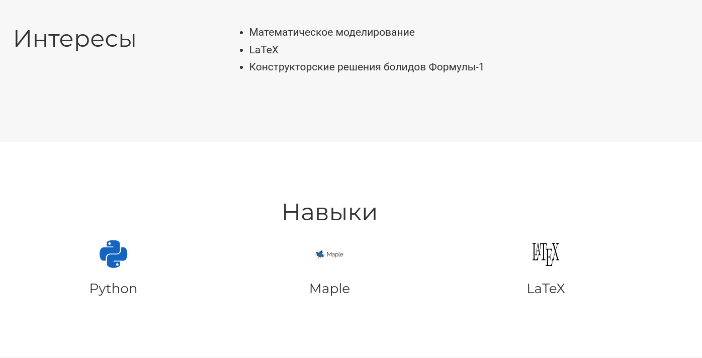
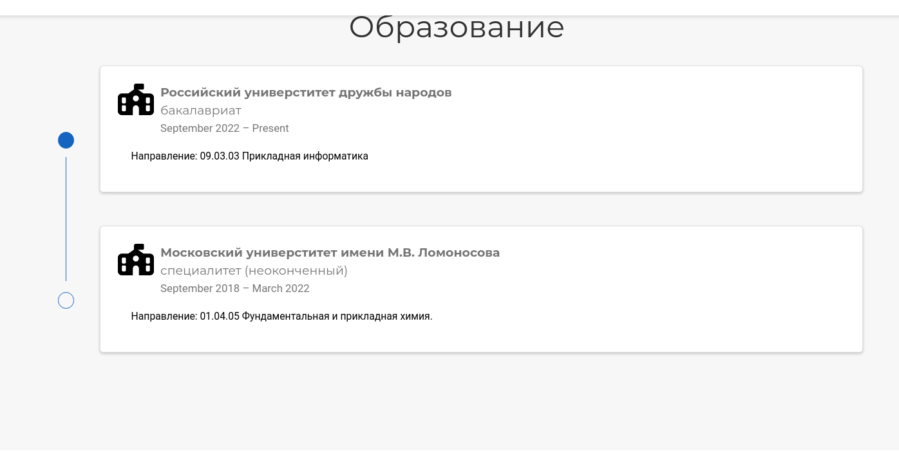
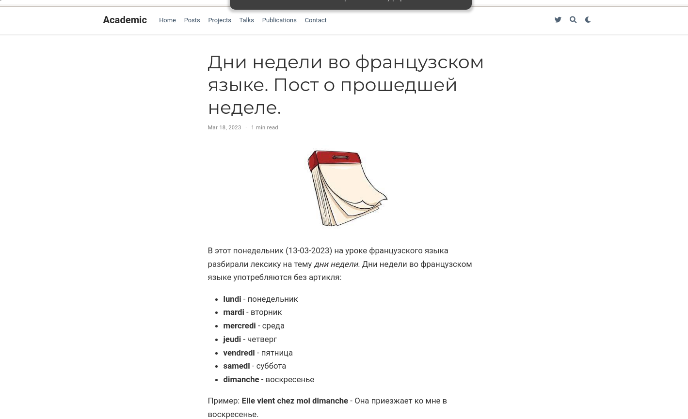
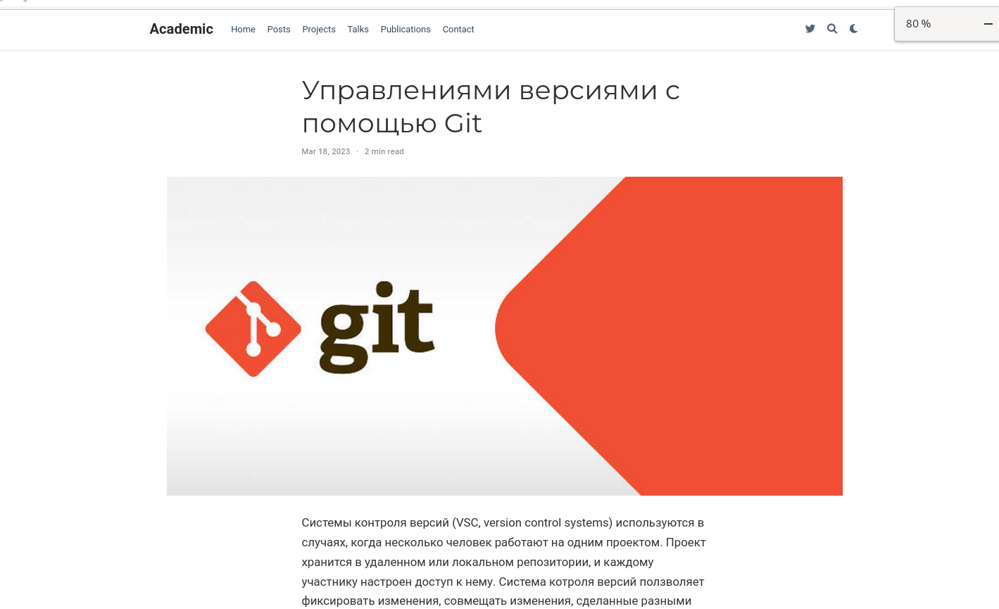

---
## Front matter
title: "Отчет по Персональному проекту. Этап 2"
subtitle: "Добавление данных о себе"
author: "Данила Андреевич Стариков"

## Generic otions
lang: ru-RU
toc-title: "Содержание"

## Bibliography
bibliography: bib/cite.bib
csl: pandoc/csl/gost-r-7-0-5-2008-numeric.csl

## Pdf output format
toc: true # Table of contents
toc-depth: 2
lof: false # List of figures
lot: false # List of tables
fontsize: 12pt
linestretch: 1.5
papersize: a4
documentclass: scrreprt
## I18n polyglossia
polyglossia-lang:
  name: russian
  options:
	- spelling=modern
	- babelshorthands=true
polyglossia-otherlangs:
  name: english
## I18n babel
babel-lang: russian
babel-otherlangs: english
## Fonts
mainfont: PT Serif
romanfont: PT Serif
sansfont: PT Sans
monofont: PT Mono
mainfontoptions: Ligatures=TeX
romanfontoptions: Ligatures=TeX
sansfontoptions: Ligatures=TeX,Scale=MatchLowercase
monofontoptions: Scale=MatchLowercase,Scale=0.9
## Biblatex
biblatex: true
biblio-style: "gost-numeric"
biblatexoptions:
  - parentracker=true
  - backend=biber
  - hyperref=auto
  - language=auto
  - autolang=other*
  - citestyle=gost-numeric
## Pandoc-crossref LaTeX customization
figureTitle: "Рис."
tableTitle: "Таблица"
listingTitle: "Листинг"
lofTitle: "Список иллюстраций"
lotTitle: "Список таблиц"
lolTitle: "Листинги"
## Misc options
indent: true
header-includes:
  - \usepackage{indentfirst}
  - \usepackage{float} # keep figures where there are in the text
  - \floatplacement{figure}{H} # keep figures where there are in the text
---

# Цель работы

Добавить к сайту данные о себе.

- Список добавляемых данных:

* Разместить фотографию владельца сайта.
* Разместить краткое описание владельца сайта (Biography).
* Добавить информацию об интересах (Interests).
* Добавить информацию об образовании (Education).
* Сделать пост по прошедшей неделе.
* Добавить пост на тему по выбору: Управление версиями. Git.

# Выполнение лабораторной работы
1. Добавали фотографию владельца сайта (Рис. [-@fig:fig01]).
2. Добавили краткое описание владельца сайта (Biography) (Рис. [-@fig:fig01]).

{#fig:fig01 width=70%} 

3. Добавлили информацию об интересах (Рис. [-@fig:fig02])

{#fig:fig02 width=70%} 

4. Добавили информацию об образовании (Рис. [-@fig:fig03])

{#fig:fig03 width=70%} 

5. Сделали пост о прошедшей недели (Рис. [-@fig:fig04])

{#fig:fig04 width=70%} 

6. Сделали пост на тему по выбору: Управление версиями. Git. (Рис. [-@fig:fig05])

{#fig:fig05 width=70%} 

# Выводы

В рамках второго этапа персонального проекта заполнили начальную информацию о владельце сайта и написали 2 поста.

