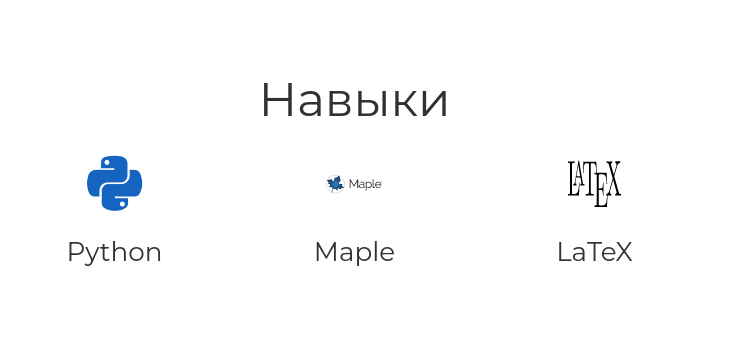
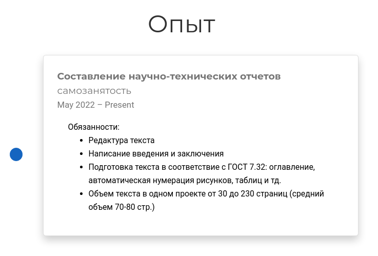
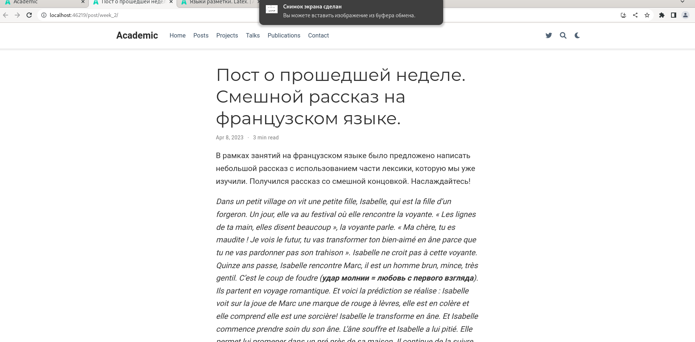
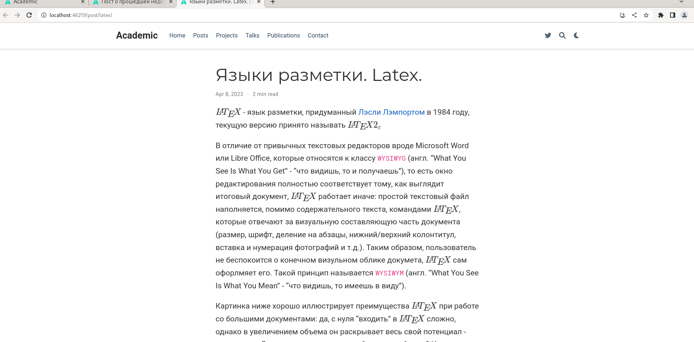

---
## Front matter
lang: ru-RU
title: "Персональный сайт научного работника. Этап 3"
subtitle: "Дисциплина: Операционные системы"
author:
  - Стариков Д. А., cтудент НПИбд-02-22
institute:
  - Российский университет дружбы народов, Москва, Россия
date: 8 апреля 2023

## i18n babel
babel-lang: russian
babel-otherlangs: english

## Formatting pdf
toc: false
toc-title: Содержание
slide_level: 2
aspectratio: 169
section-titles: true
theme: metropolis
header-includes:
 - \metroset{progressbar=frametitle,sectionpage=progressbar,numbering=fraction}
 - '\makeatletter'
 - '\beamer@ignorenonframefalse'
 - '\makeatother'
 
figureTitle: "Рис."
---

## Цели и задачи

Добавить к сайту данные о себе.

- Список добавляемых данных:

* Список достижений
   * Добавить информацию о навыках (Skills).
   * Добавить информацию об опыте (Experience).
* Сделать пост по прошедшей неделе.
* Добавить пост на тему по выбору: языки разметки. LaTeX.

# Выполнение этапа 3.

## Добавили информацию о навыках (Skills).

{#fig:fig01}

## Добавить информацию об опыте (Experience).

{#fig:fig02 width=70%}

## Сделать пост по прошедшей неделе.

{#fig:fig03}

## Добавить пост на тему по выбору: языки разметки. LaTeX.

{#fig:fig04}

# Выводы

В рамках третьего этапа персонального проекта на сайт добавлены информация о навыках, опыте, и написаны 2 поста.
