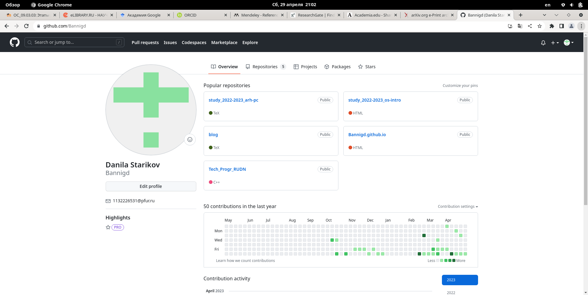
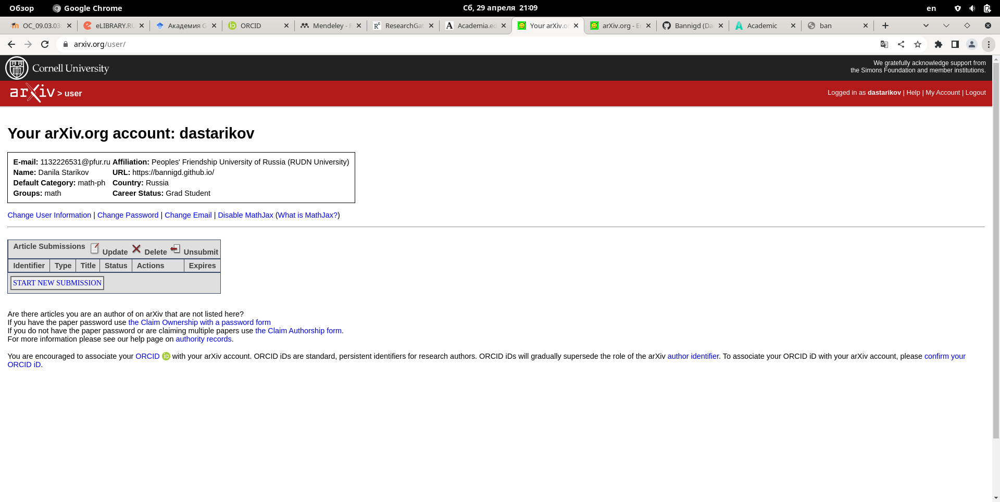
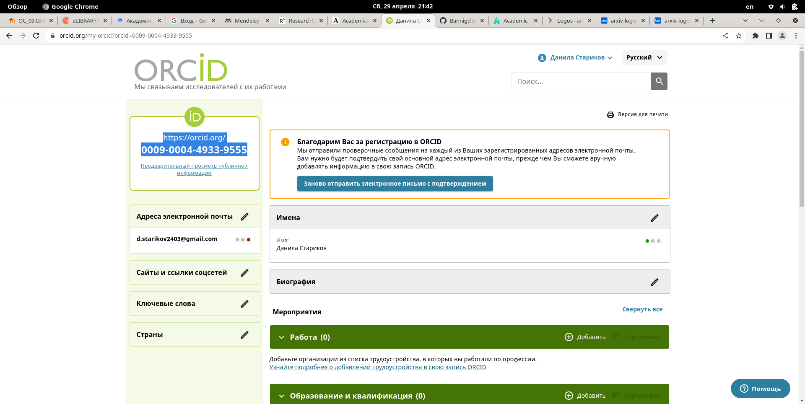
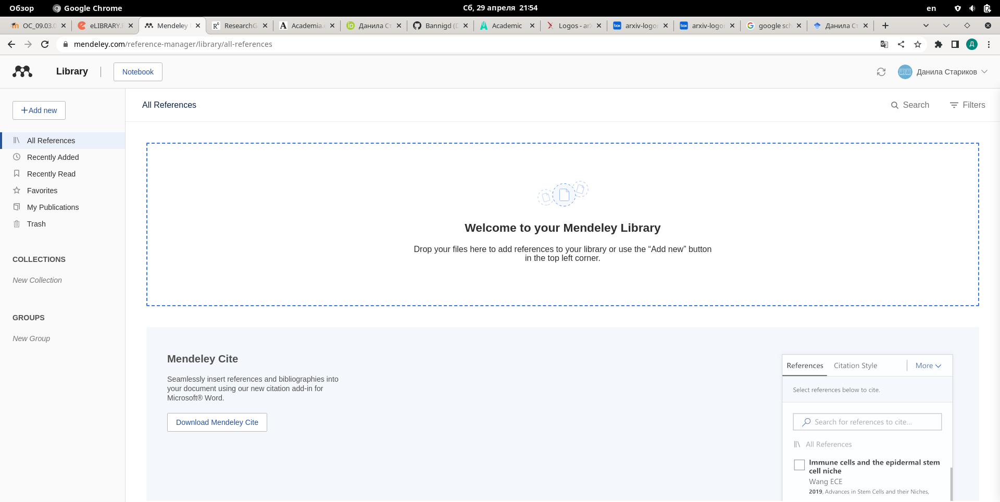
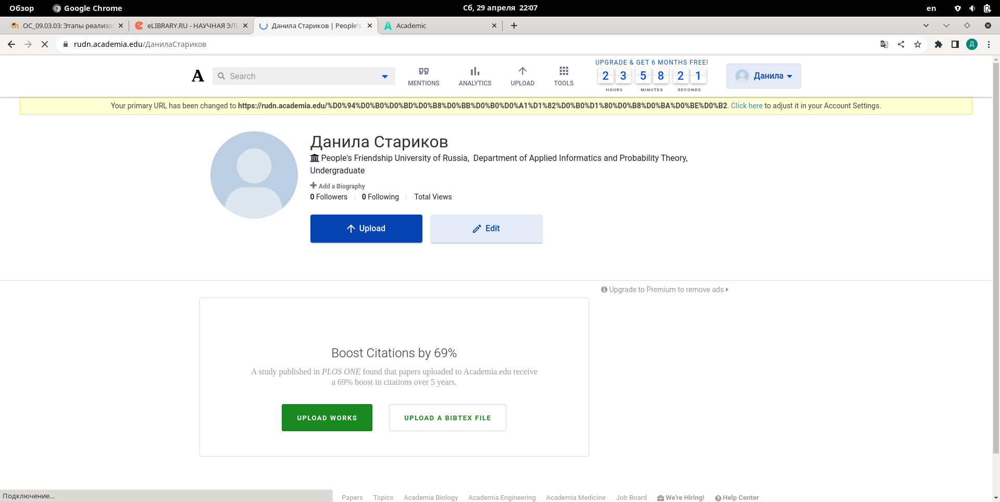
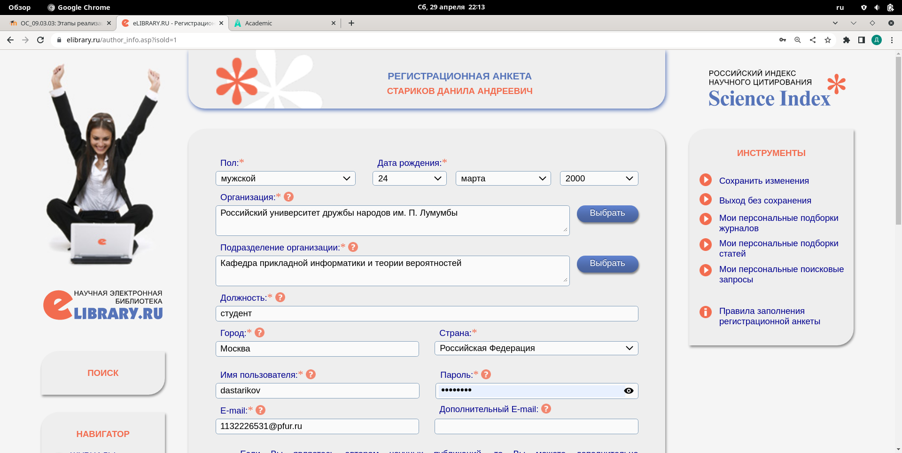
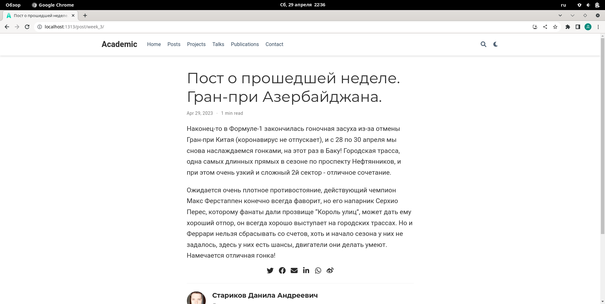
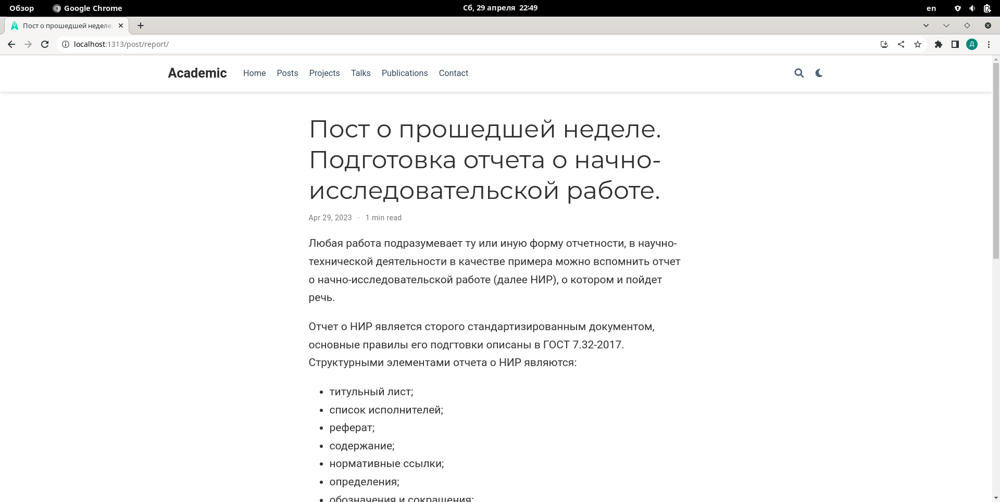

---
## Front matter
lang: ru-RU
title: "Индивидуальный проект. Этап 4."
subtitle: "Дисциплина: Операционные системы"
author:
  - Стариков Д. А., cтудент НПИбд-02-22
institute:
  - Российский университет дружбы народов, Москва, Россия
date: 29 апреля 2023

## i18n babel
babel-lang: russian
babel-otherlangs: english

## Formatting pdf
toc: false
toc-title: Содержание
slide_level: 2
aspectratio: 169
section-titles: true
theme: metropolis
header-includes:
 - \metroset{progressbar=frametitle,sectionpage=progressbar,numbering=fraction}
 - '\makeatletter'
 - '\beamer@ignorenonframefalse'
 - '\makeatother'
---

# Цель работы

1. Зарегистрироваться на соответствующих ресурсах и разместить на них ссылки на сайте:
- `eLibrary`
- `Google Scholar`
- `ORCID`
- `Mendeley`
- `ResearchGate`
- `Academia.edu`
- `arXiv`
- `github`

2. Сделать пост по прошедшей неделе.

3. Добавить пост на тему по выбору: оформление отчёта.

# Выполнение лабораторной работы

## Задание 1.

1. Зарегистрировались на соответствующих ресурсах и разместить на них ссылки на сайте:
- `eLibrary`
- `Google Scholar`
- `ORCID`
- `Mendeley`
- `ResearchGate`
- `Academia.edu`
- `arXiv`
- `github`

## Задание 1.

{#fig:fig01}

## Задание 1.

{#fig:fig02}

## Задание 1.

{#fig:fig03}

## Задание 1.

{#fig:fig04}

## Задание 1.

{#fig:fig05}

## Задание 1.

{#fig:fig06}

## Задание 2.

2. Сделали пост по прошедшей неделе о Гран-при Азербайджана.

{#fig:fig07}

## Задание 3.

3. Добавили пост на тему по выбору: оформление отчёта.

{#fig:fig08}

# Выводы

На 4 этапе индивидумального проекта зарегистрировались на наукометрических ресурсах и написали 2 поста.

